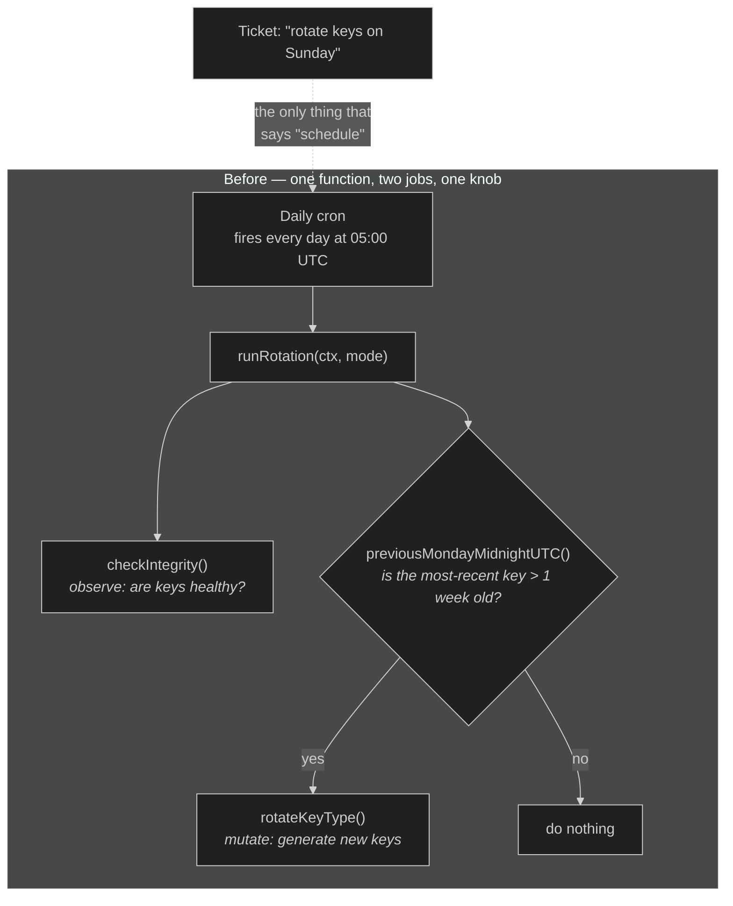
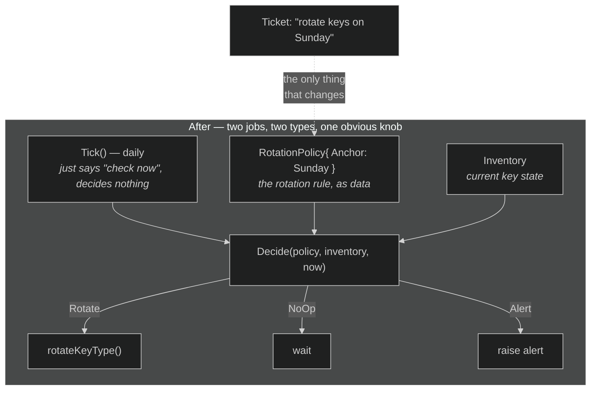

# The Cron and the Gate: When the Operator Models Itself Instead of the Domain

> **In plain English:** A ticket said "rotate keys on Sunday instead of Monday." An engineer found a variable literally named `cronSchedule`, changed it, and shipped — because that's the only knob in the file that mentions "schedule." Two senior engineers reverted it: the *real* rotation rule was buried inside a different function, disguised as a date-math comparison. Fixing one line took four commits. Nobody on the team thought that was excessive — because the code has no place to put "the rotation rule" as its own thing. It's not a training problem. It's that the two different jobs — "check on this every day" and "do this specific mutation once a week" — were written as one function, so nothing in the code tells you they're different. This happens by default in Kubernetes operators, for a specific, mechanical reason explained below.

*A one-line acceptance criterion — "rotate keys on Sunday instead of Monday" — produced four commits, two reverts, a Slack correction from two senior engineers, and a misread that nobody on the team thought was unreasonable. The misread wasn't carelessness. It was the natural reading. And the reason it was natural is a structural property of how Kubernetes operators are built. This article walks the example down to the design choice that made the misread possible, and argues the gap is unfixable inside the operator-mindset frame.*

---

## The Artifact

A Kubernetes operator owns CloudFront signing keypair rotation. The package has roughly the shape every kubebuilder template produces:

```
pkg/credentialrotation/
  trigger.go      // cronSchedule = "0 5 * * *"; Start(); manualTrigger chan
  rotation.go     // runRotation(ctx, mode); rotateKeyType()
  integrity.go    // checkIntegrity(); previousMondayMidnightUTC()
  metrics.go      // gauges populated as side-effects of runRotation
```

A backlog ticket appears with one bullet in its acceptance criteria:

> *Update the rotation time for the keys to happen on Sunday rather than Monday.*

The engineer assigned to the ticket reads it. There is a constant called `cronSchedule` at the top of `trigger.go`. There is a string `"0 5 * * *"` which is plainly the "rotation time." The fix is one character: change `*` to `0`, the cron will now fire only on Sunday at 05:00 UTC. A test is added asserting the schedule fires on Sundays. The PR is opened, reviewed, merged.

Two senior engineers then point out: this is wrong. The cron is supposed to fire **every day** to validate system integrity. The *rotation* (the act of generating new keys, advancing secret stages) is what should happen on Sunday — and it's gated separately, inside `checkIntegrity()`, by a function called `previousMondayMidnightUTC()` whose return value determines whether the most-recent key is older than the week-boundary. The fix is to move the boundary one day earlier, not to gut the cron.

The PR gets reverted. A new PR is opened: revert the cron change, rename `previousMondayMidnightUTC` to `previousSundayMidnightUTC`, ship. Four commits in total, two of which are reverts, to change one variable in one comparison.

Nobody on the team thinks this is excessive overhead. They've absorbed the pattern.

---

## The Misread Was the Natural Reading

The engineer didn't misread the AC. They read it correctly against the **vocabulary the package presented to them**. When you open `trigger.go` and the first identifier you see is a constant literally named `cronSchedule`, and the ticket says "the rotation time" — these map onto each other. The reading is not careless. It's the reading the codebase rewards.

The senior engineers pushing back have a different model in their heads. In *their* model, "trigger" and "rotation" are different concerns. The trigger is a heartbeat that probes whether the world matches expectations; rotation is a state transition that happens only when those expectations diverge. They learned this distinction the hard way — probably through an incident, or because one of them wrote the original code. The distinction lives in their heads, not in the type system.

This is the gap. The model the senior engineers reason with is **not present in the code**. Anyone joining the team gets the model only through Slack threads and after-the-fact corrections, not by reading the package and seeing the abstractions named.

If the code looked like this instead:

```
pkg/keypair/
  policy.go         // RotationPolicy{ Cadence, Anchor weekday, OverlapWindow }
  inventory.go      // Inventory{ AllKeys, ActiveStages, MostRecent } — read-only
  decision.go       // Decide(policy, inventory, now) Decision
  metrics.go        // exports a Collector that reads Inventory passively

pkg/controller/keypair/
  trigger.go        // cron just calls Tick() — doesn't decide anything
  reconciler.go     // fetches Inventory, calls Decide(), applies the Decision
```

Then the AC bullet would have routed unambiguously: *"change `RotationPolicy.Anchor` from Monday to Sunday."* No reviewer with this layout would have reached for the cron-string constant. The constant isn't even in a file the policy author would open. The misread becomes structurally impossible.

This isn't hindsight bias. The senior engineers' correction *is* exactly the implicit model above. They just never wrote it down.

---

## The Cron and the Gate Are Different Types

Look closely at what got conflated. `runRotation(ctx, mode)` does two things:

1. Calls `checkIntegrity()` — a steady-state observation of "do the CRs match the AWS secret stages, and how old is the most-recent key."
2. *If* `NeedsRotation` is true (gated by the previous-Monday comparison), invokes `rotateKeyType()` — a mutation that generates new keys.

These are not the same operation. One is **idempotent and observational**; the other is **mutating and transactional**. They share a function only because the cron driver triggers both at the same time. In a domain-modeled version they wouldn't share anything except the `Inventory` they both read.





The "before" diagram is why the misread was natural: the ticket says "schedule," and `cronSchedule` is the only identifier in the file that says "schedule" back — even though it controls the *daily heartbeat*, not the *weekly rotation rule* buried in the date-math inside the gate. The "after" diagram is the fix nobody shipped: once the rotation rule is its own typed value (`RotationPolicy`), there is exactly one place a "change the day" ticket can go, and the cron string becomes permanently boring.

The conflation produces three downstream pathologies, all visible in the same package:

**1. The cron carries policy.** Because "trigger" and "rotation" share a code path, the cron-schedule string is the only obvious place to encode "rotation cadence." When someone tries to change the cadence, they reach for the cron. The fact that the cadence is *already* enforced by the previous-Monday gate is invisible at the call site.

**2. Metrics are side-effects of the mutation.** The three rotation gauges (`step_timestamp`, `public_key_count`, `secret_version_stages_count`) are populated inside `runRotation`. The mechanism that makes this a *silent* gap is `client_golang`'s labeled-vec behavior: a `GaugeVec` registers no time series until `.WithLabelValues(...)` is first called for a given label set. On a fresh pod, `runRotation` hasn't run, so those `.WithLabelValues` calls haven't happened, so the series don't exist yet — scraping `/metrics` returns *nothing* for those families (not zero — absent). With a daily cron the blind window is ≤24h; with the (now-reverted) weekly cron it was ≤7 days.

This is a category error. `public_key_count` is a **steady-state observation** — the number of `PublicKey` CRs currently in the cluster. It does not require a rotation event to be visible; it requires only that someone ask. The correct Prometheus pattern is a collector callback (`prometheus.NewGaugeFunc`, or a custom `Collector` whose `Collect()` reads the informer/lister cache at scrape time) — so the value is computed *when scraped*, from current state, never depending on a mutation having fired. Emitting the gauge only as a side-effect of `runRotation` reveals that the engineer modeled the metric as **"a thing that happens when rotation runs"** rather than **"a property of the system the rotation acts on."**

**3. Tests test the runtime, not the domain.** Look at the test names: `TestCronScheduleIsSunday`, `TestPreviousMondayMidnightUTC`, `TestCheckIntegrity/no-public-keys-found`. These are tests of *the operator's internal control flow* — and the reason they can only be that shape is the test harness: `envtest`/fake-client reconcile tests exercise `Reconcile()` against a stood-up (or faked) API server. Their whole vocabulary is "given this CR state on the server, call Reconcile, assert what it wrote back." That harness can express "given this `ApplicationDeployment`, what did the reconciler do," but it has no way to express "given this `RotationPolicy` and this `Inventory`, when is the next rotation due" — because there is no `RotationPolicy` type, only reconcile behavior. There is no `TestRotationPolicy_NextDueDate` because there is nothing to construct and call in isolation. The domain has no testable surface; every behavior is verified through fake-client reconcile dances.

---

## Why This Happens in K8s Specifically

The Kubernetes controller pattern, as taught by `controller-runtime` and kubebuilder, is:

- A CRD describes desired state (`spec`).
- A controller observes actual state (`status`) and runs `Reconcile()` to close the gap.
- Metrics describe the controller's *operation* — queue depth, reconcile rate, error count.

This frame is brilliant for cluster-internal lifecycle problems. Scale a Deployment to 3 replicas: spec says 3, status says 2, Reconcile creates one Pod. The frame *is* the domain.

It is a poor frame for **cross-system business invariants** that the cluster is only one participant in. Rotate a CloudFront keypair on a weekly cadence with a grace window. Drain a tenant from a CDN distribution. Expire a certificate before its `notAfter`. These are not "close a gap between spec and status." They are policies that **produce** specs and statuses over time. The cadence is not a state. The grace window is not a state. The "rotate on Sunday" rule is not a state.

But the framework only gives you one place to put logic: `Reconcile(ctx, req)`. And here's the mechanical reason that one place can't carry policy cleanly: `Reconcile()` is triggered *identically* by three different causes, and it cannot tell them apart. (1) An informer **watch event** — a human or controller changed the object. (2) The **resync period** — controller-runtime re-delivers every cached object on a timer (`SyncPeriod`, default ~10h) even with no change. (3) A **`RequeueAfter`** the reconciler itself asked for last time. All three arrive as the same `Reconcile(ctx, req)` call with the same signature; there is no `event.Type` to branch on, no "this is a resync, not a create." So a reconciler that needs to behave differently on "the object was just created" versus "it's a periodic tick" has to *reconstruct* that distinction from state — and the cadence, having nowhere typed to live, ends up encoded as a cron string plus a timestamp comparison inside the one hook. The grace window becomes a `time.Now().Sub(creationTimestamp)` comparison; the "rotate on Sunday" rule becomes `previousMondayMidnightUTC()`. None of these have types. None are individually testable. The operator's runtime ends up *being* the model.

The tooling reinforces the framing at every step. CRDs feel like the natural place to model the domain — but a CRD is a Kubernetes API object, not a business object. Its fields end up describing what the controller *does*, not what the business *cares about*. `Reconcile()` is the natural place to put logic, so all the policy lives there. Metrics are wired by the framework defaults to describe controller health, so business observations get bolted on as side-effects. Tests are scaffolded as "given this CR state, what does Reconcile do," so no place exists to write "given this `RotationPolicy` and this `Inventory`, when is the next rotation due."

---

## The Operator Mindset Cannot See the Gap

There is a deeper layer. Most engineers building Kubernetes operators are not modelers by training. The framework's mental model is the only model they were taught. When you describe to them what's missing — that "trigger" and "rotation" are different types, that metrics should be observations not side-effects, that policy is a value object that produces decisions — the response is usually a polite version of *"that's a lot of abstraction for what is, mechanically, three function calls."*

That response is honest. From inside the operator mindset, the framework already provides all the abstraction the problem needs. `Reconcile()` is the abstraction. The cron is the abstraction. The CRD is the abstraction. Asking for more is, from that frame, gold-plating.

The Stockholm-syndrome dynamic is well-documented in this series ([Operator Stockholm Syndrome](/articles/k8s-operator-stockholm-syndrome/), [The Operator Mindset](/articles/k8s-operator-mindset-vs-domain-modeling/)): a frame that doesn't fit the problem feels native to people who have spent years inside it, and any attempt to point outside the frame reads as overreach. The cron-and-gate confusion is not an exception to that pattern. It is a textbook instance.

---

## Why It Doesn't Get Fixed

A reader of this article may be tempted to propose: refactor the package into a domain layer + controller binding. Don't.

Refactor PRs in this kind of codebase die. The business outcome — keys rotate on Sunday — is already achieved by the cron+gate fix. The refactor is invisible work that pays out over years through the next ten changes being faster and safer. No one is paid for that. No team allocates sprint capacity to "make future tickets less likely to misread."

The framework keeps producing the same shape of package because the templates and the senior engineers' mental models both reinforce it. A single domain-modeled package in a codebase full of runtime-modeled ones reads as inconsistent and gets pressure to "follow the convention." The convention is the problem, but the convention is what defines competence inside the team.

Domain-driven design vocabulary — bounded context, aggregate, value object, policy, domain event — does not translate well in this culture. "Reconcile" and "controller" feel concrete; "policy" and "decision" feel abstract. The concrete-feeling thing wins every argument, even when the abstract-feeling thing would have prevented the four-commits-and-two-reverts dance that just occurred.

And critically: the people who would have to approve the refactor are the same people whose mental model is the problem. They are not malicious. They are not lazy. They are reading the proposal through exactly the frame the proposal is trying to escape.

---

## The Marker

What's worth doing is small and personal. Write down, somewhere durable, that this artifact happened. Name the pattern. The next engineer who picks up an AC of the form "rotate on Sunday" — or "change the timeout" or "make this happen during business hours" — will, if they read your note, have a chance to ask *which layer the verb belongs in* before they touch the obvious-looking constant.

That's the whole intervention. Not refactor the operator. Not lecture the team. Just leave a marker that the misread is structural, not personal, and that the layers — trigger, policy, decision, action, observation — exist even when the code doesn't name them.

If two or three more tickets accumulate that hit the same pattern, the team may eventually do the refactor on their own. They will believe they thought of it. That is the correct outcome. The point was never the credit. The point was the marker.

---

## What the Domain Looks Like (For the Reader Who Squints)

Sketched for completeness, with no expectation of ever being implemented:

```go
// pkg/keypair/policy.go
type RotationPolicy struct {
    Cadence       time.Duration  // 7 * 24 * time.Hour
    Anchor        time.Weekday   // time.Sunday
    OverlapWindow time.Duration  // grace period during which both keys are accepted
}

func (p RotationPolicy) NextDueAfter(lastRotation time.Time) time.Time { ... }

// pkg/keypair/inventory.go
type Inventory struct {
    AllKeys       []PublicKey
    ActiveStages  map[string]string  // AWS Secrets Manager stage → key ID
    MostRecent    *PublicKey
}

// pkg/keypair/decision.go
type Decision interface{ isDecision() }

type Rotate struct{ Reason string }
type NoOp   struct{ NextDue time.Time }
type Alert  struct{ Reason string }   // integrity violations

func Decide(p RotationPolicy, inv Inventory, now time.Time) Decision { ... }
```

The `cronSchedule` constant in this world is `"0 5 * * *"` and stays that way forever. The rotation cadence lives in `RotationPolicy{Cadence: 7*24*time.Hour, Anchor: time.Sunday}`. The AC "rotate on Sunday rather than Monday" becomes a one-line change to one struct literal. No reviewer would have routed it to the cron. The misread is not just unlikely — it is *unrepresentable*.

That's what it means for a model to fit. And that's why the gap between what the operator mindset produces and what software engineering produces is not a matter of effort. It is a matter of which abstractions exist as types and which exist only in senior engineers' heads.

---

## Related

- [The Operator Mindset: Why One Domain Becomes Six Repositories](/articles/k8s-operator-mindset-vs-domain-modeling/) — the broader frame this article instantiates
- [Operator Stockholm Syndrome: When the K8s Control Plane Becomes the Universe](/articles/k8s-operator-stockholm-syndrome/) — why the gap is invisible from inside
- [The Abstraction Instinct: What No Tool Can Provide](/articles/k8s-abstraction-instinct/) — why no tooling investment fixes this

---

### Series: Why Kubernetes Infrastructure Rots

- **Part 1: [The Operator Mindset](/articles/k8s-operator-mindset-vs-domain-modeling/)** — Why one domain becomes six repositories. The repo-per-problem anti-pattern as a consequence of thinking in procedures instead of models.

- **Part 2: [The Cargo Cult](/articles/k8s-cargo-cult-centralization/)** — Why shared repos and better tools don't fix it. The failed abstraction phase.

- **Part 3: [The Abstraction Instinct](/articles/k8s-abstraction-instinct/)** — What no tool can provide. CDK in the hands of an operator is still operator thinking.

- **Part 4: [The Distributed Monolith](/articles/k8s-gitops-distributed-monolith/)** — Why your GitOps is a monolith wearing a microservices costume. Five repos, five teams, zero transactional boundary, and six incidents in four weeks.

- **Part 5: [The Staging Mindset](/articles/k8s-staging-mindset-kills-migration/)** — Routing is atomic. Deployment is not. Why feature flags are what happens when the infrastructure can't express version coexistence.

- **Part 6: [The Shared Mutable State](/articles/k8s-cr-shared-mutable-state/)** — The CR is a database table with no foreign keys, shared between controllers with no ownership model. Silent data loss as a design consequence.

- **Aside: [Operator Stockholm Syndrome](/articles/k8s-operator-stockholm-syndrome/)** — When the K8s control plane becomes the universe. Routing every cloud API through a cluster CR even when the cluster has no semantic role.

- **Aside: [The Cron and the Gate](/articles/k8s-cron-and-gate/)** — When the operator models itself instead of the domain. One `Reconcile()` hook, triggered identically by create/resync/requeue, becomes the only place policy can live. *(this article)*

- **Aside: [The Configuration Problem](/articles/k8s-tribal-knowledge/)** — One business rule sliced across Helm, ConfigMap, Flux substitution, and Calico's dataplane — zero cohesion, load-bearing tribal knowledge.

- **Aside: [The Auto-Approve](/articles/k8s-auto-approve-swallows-the-gate/)** — When the reconcile loop swallows `terraform plan`. Wrapping a tool with a human-in-the-loop gate in a loop that structurally can't hold one.

- **Aside: [You Can't Front-Run the Composition Gap](/articles/k8s-front-run-composition-gap/)** — Why correct first-principles reasoning must crash once before it can diagnose.

- **Lab: [Verify It Yourself](/articles/k8s-verify-it-yourself/)** — Copy-pasteable, real-output reproductions of every cluster mechanism the series cites (foreign keys, CEL scope, ownerRefs, SSA, PUT-strips-fields, resourceVersion, CRD versioning, kstatus).

- **Synthesis: [The Thermostat That Ate Infrastructure](/articles/k8s-thermostat-not-a-deployment-engine/)** — How a container self-healing pattern became a deployment engine. The missing DAG from node boot to infrastructure blue/green.
