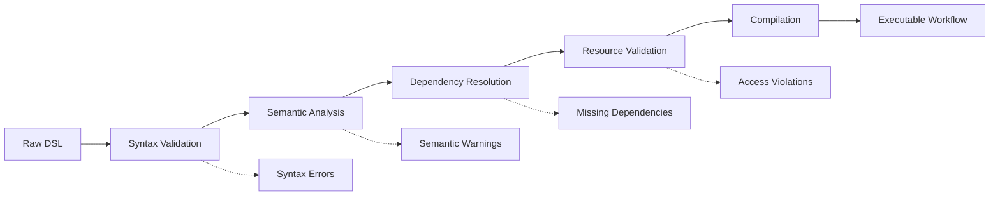

# AI Agent Workflow DSL: Schema Design & Specification

*Comprehensive DSL design for conversational workflow generation with version management and execution semantics*

## Overview

The Workflow DSL serves as the bridge between conversational AI agents and the workflow execution engine. It provides a structured, versionable format that captures user intent while maintaining sufficient detail for reliable execution.

## Core Design Principles

### 1. **Conversational Origin Tracking**
- Every DSL element links back to conversation context
- Preserves user intent and AI reasoning
- Enables regeneration and refinement

### 2. **Execution Completeness** 
- Contains all information needed for execution
- No ambiguous or underspecified elements
- Clear error handling and retry semantics

### 3. **Version Evolution**
- Backward compatibility within major versions
- Clear migration paths between versions
- Schema validation and transformation

## DSL Schema Structure

### Root Schema (v1.0)

```json
{
  "$schema": "https://platform.example.com/workflow-dsl/v1.0/schema.json",
  "apiVersion": "workflow.platform/v1",
  "kind": "Workflow",
  "metadata": {
    "name": "customer-onboarding-flow",
    "version": "1.2.3",
    "accountId": "acct-001",
    "conversationId": "conv-uuid",
    "description": "Automated customer onboarding with validation steps",
    "labels": {
      "domain": "crm",
      "priority": "high",
      "owner": "team-growth"
    },
    "annotations": {
      "platform.ai/generated-by": "ai-agent-v1.5",
      "platform.ai/conversation-summary": "User wanted automated email sequence with approval gates"
    }
  },
  "spec": {
    "trigger": {
      "type": "manual",
      "conditions": [],
      "schedule": null
    },
    "parameters": {
      "input": [
        {
          "name": "customerId",
          "type": "string",
          "required": true,
          "description": "Unique customer identifier"
        },
        {
          "name": "marketingConsent",
          "type": "boolean",
          "required": false,
          "default": false
        }
      ],
      "output": [
        {
          "name": "onboardingStatus",
          "type": "string",
          "description": "Final onboarding result"
        }
      ]
    },
    "tasks": [],
    "flows": [],
    "errorHandling": {},
    "resources": {},
    "timeouts": {}
  },
  "status": {
    "phase": "draft",
    "lastModified": "2024-01-15T10:30:00Z",
    "validationStatus": "valid",
    "executionCount": 0
  }
}
```

### Task Definition Schema

```json
{
  "tasks": [
    {
      "id": "validate-customer",
      "type": "http",
      "name": "Validate Customer Data",
      "description": "Verify customer information in CRM system",
      "conversationContext": {
        "messageId": "msg-uuid",
        "userIntent": "Need to verify customer exists before proceeding",
        "aiReasoning": "Added validation step to prevent downstream errors"
      },
      "config": {
        "http": {
          "url": "https://crm.company.com/api/customers/{{.customerId}}",
          "method": "GET",
          "headers": {
            "Authorization": "Bearer ${secrets.crm-token}",
            "Content-Type": "application/json"
          },
          "timeout": "30s",
          "retries": {
            "count": 3,
            "backoff": "exponential",
            "initialDelay": "1s"
          }
        }
      },
      "inputs": {
        "customerId": "{{ .input.customerId }}"
      },
      "outputs": {
        "customerData": "{{ .response.body }}",
        "isValid": "{{ .response.status == 200 }}"
      },
      "conditions": {
        "skip": "{{ .input.customerId == '' }}",
        "success": "{{ .outputs.isValid }}",
        "failure": "{{ .response.status >= 400 }}"
      }
    },
    {
      "id": "send-welcome-email",
      "type": "email",
      "name": "Send Welcome Email",
      "depends": ["validate-customer"],
      "config": {
        "email": {
          "provider": "sendgrid",
          "template": "welcome-template-v2",
          "to": "{{ .validate-customer.outputs.customerData.email }}",
          "subject": "Welcome to Our Platform!",
          "variables": {
            "customerName": "{{ .validate-customer.outputs.customerData.name }}",
            "accountTier": "{{ .validate-customer.outputs.customerData.tier }}"
          }
        }
      }
    }
  ]
}
```

### Flow Control Schema

```json
{
  "flows": [
    {
      "id": "approval-gate",
      "type": "conditional",
      "name": "Marketing Approval Gate",
      "condition": "{{ .input.marketingConsent == true }}",
      "branches": {
        "true": {
          "tasks": ["send-marketing-email", "add-to-newsletter"]
        },
        "false": {
          "tasks": ["skip-marketing"]
        }
      }
    },
    {
      "id": "parallel-setup",
      "type": "parallel",
      "name": "Parallel Account Setup",
      "branches": [
        {
          "name": "technical-setup",
          "tasks": ["create-api-keys", "setup-webhooks"]
        },
        {
          "name": "business-setup", 
          "tasks": ["assign-account-manager", "schedule-kickoff"]
        }
      ],
      "joinPolicy": "all" // or "any", "atLeast(n)"
    },
    {
      "id": "retry-loop",
      "type": "loop",
      "name": "Retry Failed Integrations",
      "condition": "{{ .setup-integrations.status == 'failed' }}",
      "maxIterations": 3,
      "tasks": ["setup-integrations"],
      "breakCondition": "{{ .setup-integrations.status == 'success' }}"
    }
  ]
}
```

### Error Handling Schema

```json
{
  "errorHandling": {
    "global": {
      "onError": "continue", // "continue", "stop", "rollback"
      "notificationChannels": ["email", "webhook"],
      "escalationPolicy": {
        "levels": [
          {
            "delay": "5m",
            "action": "retry",
            "maxAttempts": 2
          },
          {
            "delay": "30m", 
            "action": "notify",
            "recipients": ["${account.owner}", "${workflow.creator}"]
          },
          {
            "delay": "2h",
            "action": "escalate",
            "recipients": ["ops-team@company.com"]
          }
        ]
      }
    },
    "taskSpecific": {
      "validate-customer": {
        "onTimeout": {
          "action": "skip",
          "defaultOutputs": {
            "isValid": false,
            "customerData": null
          }
        },
        "onHttpError": {
          "4xx": {
            "action": "fail",
            "message": "Customer validation failed - invalid request"
          },
          "5xx": {
            "action": "retry",
            "maxAttempts": 5,
            "backoff": "exponential"
          }
        }
      }
    }
  }
}
```

### Resource Management Schema

```json
{
  "resources": {
    "secrets": [
      {
        "name": "crm-token",
        "type": "bearer-token",
        "source": {
          "kubernetes": {
            "secretName": "crm-credentials",
            "key": "token"
          }
        }
      },
      {
        "name": "sendgrid-api-key",
        "type": "api-key",
        "source": {
          "cloud": {
            "provider": "aws",
            "secretManager": "secrets-manager",
            "secretId": "prod/sendgrid/api-key"
          }
        }
      }
    ],
    "external": [
      {
        "name": "customer-database",
        "type": "database",
        "connection": {
          "type": "postgresql",
          "host": "${secrets.db-host}",
          "database": "customers",
          "credentials": "${secrets.db-credentials}"
        }
      }
    ],
    "limits": {
      "maxDuration": "2h",
      "maxMemory": "512Mi",
      "maxCPU": "500m",
      "maxConcurrentTasks": 10
    }
  }
}
```

## DSL Versioning Strategy

### Version Compatibility Matrix

```yaml
DSL_VERSION_COMPATIBILITY:
  v1.0.x:
    - Compatible with engine v1.0+
    - Basic task orchestration
    - Simple error handling
    
  v1.1.x:
    - Compatible with engine v1.1+
    - Added parallel execution
    - Enhanced retry mechanisms
    - Backward compatible with v1.0
    
  v1.2.x:
    - Compatible with engine v1.2+
    - Advanced conditional flows
    - Resource management
    - Loop constructs
    - Backward compatible with v1.1
    
  v2.0.x:
    - Breaking changes: New task type system
    - Enhanced security model
    - Migration tools provided
```

### Schema Evolution Rules

```json
{
  "schemaEvolution": {
    "additive": {
      "allowed": [
        "new optional fields",
        "new task types",
        "additional configuration options"
      ],
      "versionBump": "minor"
    },
    "modifications": {
      "allowed": [
        "field type widening (string -> any)",
        "relaxing validation rules",
        "performance improvements"
      ],
      "versionBump": "patch"
    },
    "breaking": {
      "require": [
        "field removal",
        "type narrowing",
        "semantic changes",
        "new required fields"
      ],
      "versionBump": "major"
    }
  }
}
```

## Task Type Definitions

### Built-in Task Types

```json
{
  "taskTypes": {
    "http": {
      "description": "HTTP API calls with full configuration",
      "schema": "schemas/tasks/http-v1.json",
      "examples": ["api-calls", "webhooks", "rest-integrations"]
    },
    "email": {
      "description": "Email sending via multiple providers",
      "schema": "schemas/tasks/email-v1.json", 
      "providers": ["sendgrid", "ses", "mailgun"]
    },
    "database": {
      "description": "Database operations with connection pooling",
      "schema": "schemas/tasks/database-v1.json",
      "supports": ["postgresql", "mysql", "mongodb"]
    },
    "script": {
      "description": "Custom code execution in sandboxed environment",
      "schema": "schemas/tasks/script-v1.json",
      "languages": ["javascript", "python", "bash"]
    },
    "approval": {
      "description": "Human approval gates with notifications",
      "schema": "schemas/tasks/approval-v1.json",
      "channels": ["email", "slack", "teams"]
    },
    "transform": {
      "description": "Data transformation and mapping",
      "schema": "schemas/tasks/transform-v1.json",
      "engines": ["jq", "jsonata", "custom"]
    }
  }
}
```

### Custom Task Type Extension

```json
{
  "customTaskTypes": {
    "registry": "custom-tasks.company.com",
    "tasks": [
      {
        "type": "salesforce-sync",
        "version": "v1.0",
        "image": "company/salesforce-task:v1.0",
        "schema": {
          "properties": {
            "operation": {
              "type": "string",
              "enum": ["create", "update", "query"]
            },
            "sobject": {"type": "string"},
            "data": {"type": "object"}
          }
        }
      }
    ]
  }
}
```

## Execution Context & State Management

### Execution State Schema

```json
{
  "executionState": {
    "executionId": "exec-uuid",
    "workflowVersion": "1.2.3",
    "startTime": "2024-01-15T10:30:00Z",
    "status": "running",
    "currentPhase": "execution",
    "context": {
      "input": {
        "customerId": "cust-12345",
        "marketingConsent": true
      },
      "variables": {
        "global": {},
        "task": {}
      },
      "outputs": {}
    },
    "taskStates": [
      {
        "taskId": "validate-customer",
        "status": "completed",
        "startTime": "2024-01-15T10:30:05Z",
        "endTime": "2024-01-15T10:30:08Z",
        "attempts": 1,
        "outputs": {
          "customerData": {...},
          "isValid": true
        }
      }
    ],
    "metrics": {
      "totalDuration": "PT2M30S",
      "tasksCompleted": 5,
      "tasksTotal": 8,
      "resourceUsage": {
        "cpu": "150m",
        "memory": "256Mi"
      }
    }
  }
}
```

## Validation & Compilation

### DSL Validation Pipeline



### Compilation Output

```json
{
  "compiledWorkflow": {
    "metadata": {},
    "executionPlan": {
      "phases": [
        {
          "name": "initialization",
          "tasks": ["setup-context", "validate-inputs"]
        },
        {
          "name": "execution",  
          "tasks": ["validate-customer", "send-welcome-email"],
          "parallelGroups": [
            ["create-api-keys", "setup-webhooks"],
            ["assign-account-manager", "schedule-kickoff"]
          ]
        },
        {
          "name": "cleanup",
          "tasks": ["cleanup-temp-resources"]
        }
      ]
    },
    "resourceMap": {
      "secrets": {...},
      "connections": {...}
    },
    "validationReport": {
      "errors": [],
      "warnings": ["Task 'optional-setup' may timeout"],
      "suggestions": ["Consider adding retry logic to 'external-api-call'"]
    }
  }
}
```

## Integration with AI Agent Context

### Conversation-to-DSL Mapping

```json
{
  "conversationMapping": {
    "conversationId": "conv-uuid",
    "messages": [
      {
        "messageId": "msg-1",
        "role": "user",
        "content": "I need to validate customers before sending emails",
        "mappedDSL": {
          "taskIds": ["validate-customer"],
          "influence": "task creation and dependency"
        }
      },
      {
        "messageId": "msg-2", 
        "role": "assistant",
        "content": "I'll add validation with retry logic",
        "mappedDSL": {
          "taskIds": ["validate-customer"],
          "influence": "retry configuration"
        }
      }
    ],
    "iterationHistory": [
      {
        "version": "1.0.0",
        "changes": ["initial creation"],
        "messageIds": ["msg-1", "msg-2"]
      },
      {
        "version": "1.1.0",
        "changes": ["added parallel execution"],
        "messageIds": ["msg-5", "msg-6"]
      }
    ]
  }
}
```

This comprehensive DSL design provides the foundation for reliable workflow execution while maintaining traceability back to the conversational origins. The schema supports complex workflows while remaining readable and maintainable. 