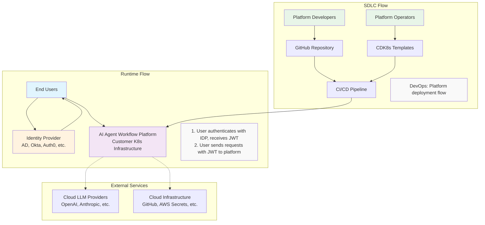
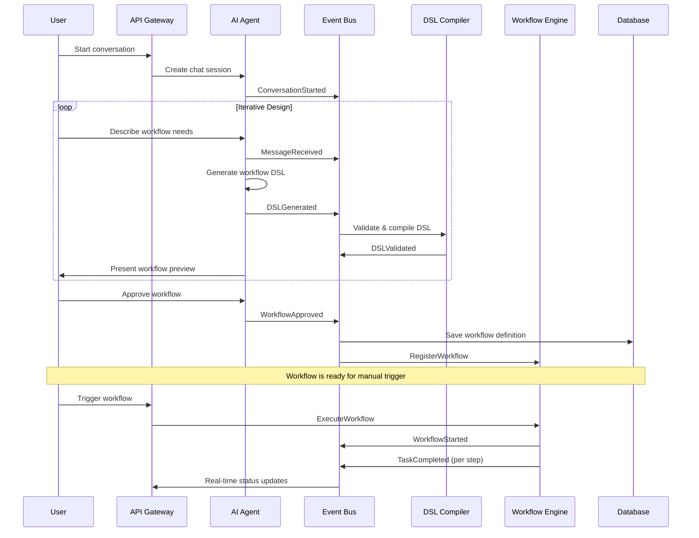
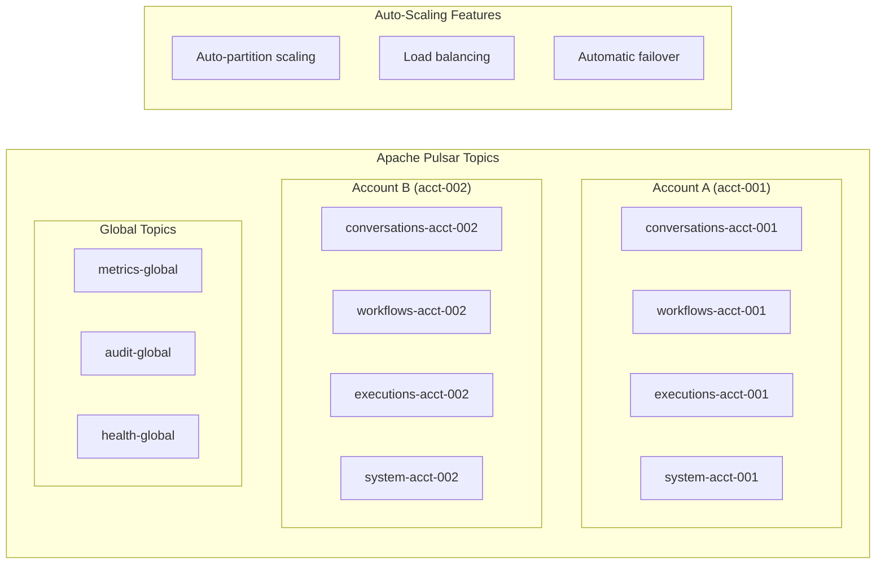
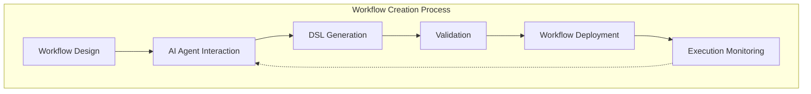
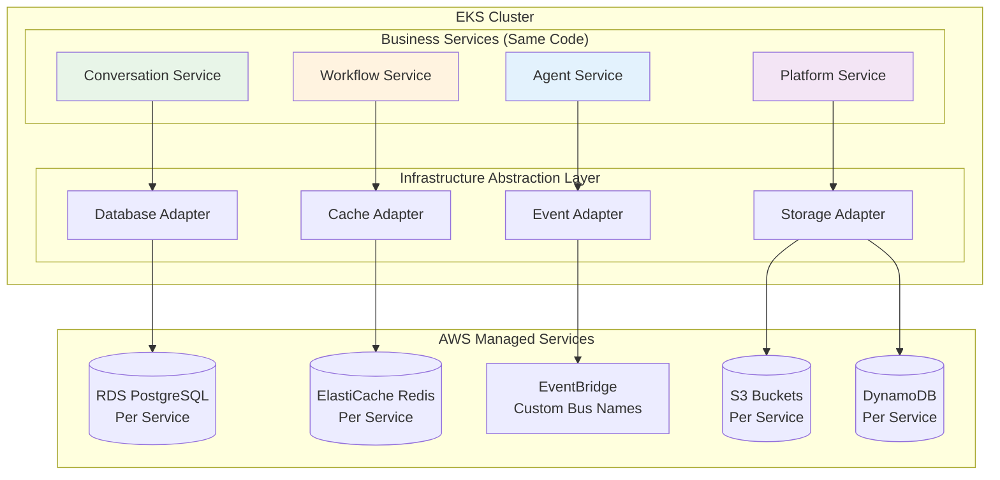
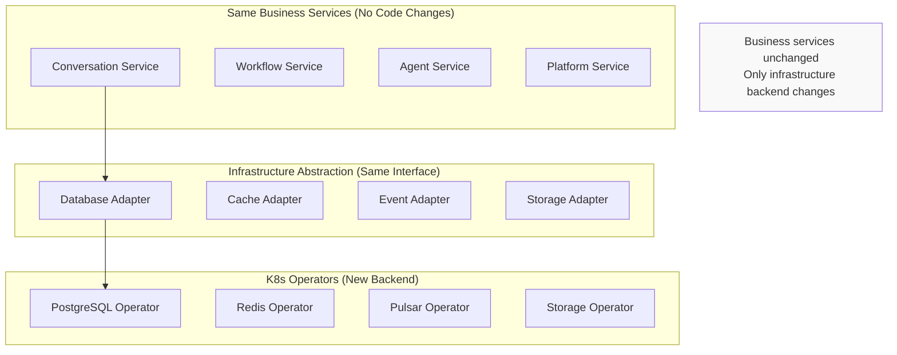

# AI Agent Workflow Platform: Enterprise Architecture Design

*A distributed, multi-tenant platform for AI-driven workflow automation with conversational DSL generation*

## Executive Summary

This document outlines the architecture for an enterprise-grade AI agent workflow platform that enables end users to define complex workflows through natural language conversations with AI agents. The platform generates executable DSL definitions, supports multi-tenancy at scale, and can be deployed across customer-managed Kubernetes clusters while leveraging cloud-based SDLC ecosystems.

## System Overview

### Core Principles
- **Conversational Workflow Design**: AI agents collaborate with users to generate workflow DSL
- **Multi-Tenant by Design**: Account-based isolation supporting thousands of tenants  
- **Cloud-Agnostic Deployment**: Runs on customer infrastructure (EKS, AKS, bare metal K8s)
- **Event-Driven Architecture**: Decoupled services communicating via auto-scaling event bus
- **Polyglot Microservices**: Multiple languages optimized per service domain
- **Zero-Trust Security**: OIDC integration with encrypted secrets management
- **Avoiding Distributed Monolith**: Direct service communication with clear boundaries - no service mesh complexity
- **Service Data Ownership**: Each microservice owns its data store and cache for independent SDLC

## High-Level Architecture

### System Overview


### Detailed Platform Services Flow (Business-First Architecture)

```mermaid
graph TB
    AUTH_IN[Authenticated Request] --> API_GW[API Gateway]
    
    subgraph "Conversation Service"
        CONV_API[API Layer]
        CONV_CQRS{CQRS Router}
        CONV_QUERY[Query Handler]
        CONV_CMD[Command Handler]
        CONV_DATA[Data Layer]
        
        CONV_API --> CONV_CQRS
        CONV_CQRS --> CONV_QUERY
        CONV_CQRS --> CONV_CMD
        CONV_QUERY --> CONV_DATA
        CONV_CMD --> CONV_DATA
    end
    
    subgraph "Workflow Service"
        WF_API[API Layer]
        WF_CQRS{CQRS Router}
        WF_QUERY[Query Handler]
        WF_CMD[Command Handler]
        WF_DATA[Data Layer]
        
        WF_API --> WF_CQRS
        WF_CQRS --> WF_QUERY
        WF_CQRS --> WF_CMD
        WF_QUERY --> WF_DATA
        WF_CMD --> WF_DATA
    end
    
    subgraph "Agent Service"
        AGENT_API[API Layer]
        AGENT_CQRS{CQRS Router}
        AGENT_QUERY[Query Handler]
        AGENT_CMD[Command Handler]
        AGENT_DATA[Data Layer]
        
        AGENT_API --> AGENT_CQRS
        AGENT_CQRS --> AGENT_QUERY
        AGENT_CQRS --> AGENT_CMD
        AGENT_QUERY --> AGENT_DATA
        AGENT_CMD --> AGENT_DATA
    end
    
    subgraph "Platform Service"
        PLATFORM_API[API Layer]
        PLATFORM_CQRS{CQRS Router}
        PLATFORM_QUERY[Query Handler]
        PLATFORM_CMD[Command Handler]
        PLATFORM_DATA[Data Layer]
        
        PLATFORM_API --> PLATFORM_CQRS
        PLATFORM_CQRS --> PLATFORM_QUERY
        PLATFORM_CQRS --> PLATFORM_CMD
        PLATFORM_QUERY --> PLATFORM_DATA
        PLATFORM_CMD --> PLATFORM_DATA
    end
    
    API_GW --> CONV_API
    API_GW --> WF_API
    API_GW --> AGENT_API
    API_GW --> PLATFORM_API
    
    subgraph "Infrastructure Controllers/Operators"
        subgraph "Event Bus Controller"
            EB_CTRL[Pulsar Operator]
            EB_API[Pulsar API<br/>Per-Tenant Topics]
        end
        
        subgraph "Database Controller"
            DB_CTRL[PostgreSQL Operator]
            DB_API[Database API<br/>Per-Service Databases]
        end
        
        subgraph "Cache Controller"
            CACHE_CTRL[Redis Operator]
            CACHE_API[Cache API<br/>Per-Service Instances]
        end
        
        subgraph "Storage Controller"
            STORAGE_CTRL[Storage Operator]
            STORAGE_API[Volume API<br/>Per-Service PVCs]
        end
        
        subgraph "LLM Controller"
            LLM_CTRL[LLM Operator]
            LLM_API[Model API<br/>Shared GPU Pool]
        end
    end
    
    subgraph "Infrastructure Access (Data Layers → Operator APIs)"
        CONV_DATA --> DB_API
        CONV_DATA --> CACHE_API
        CONV_DATA --> STORAGE_API
        
        WF_DATA --> DB_API
        WF_DATA --> CACHE_API
        WF_DATA --> STORAGE_API
        
        AGENT_DATA --> DB_API
        AGENT_DATA --> CACHE_API
        AGENT_DATA --> LLM_API
        
        PLATFORM_DATA --> DB_API
        PLATFORM_DATA --> CACHE_API
    end
    
    subgraph "Inter-Service Events (Command Handlers ↔ Event Bus)"
        CONV_CMD --> EB_API
        WF_CMD --> EB_API
        AGENT_CMD --> EB_API
        PLATFORM_CMD --> EB_API
        
        EB_API --> CONV_CMD
        EB_API --> WF_CMD
        EB_API --> AGENT_CMD
        EB_API --> PLATFORM_CMD
    end
    
    style AUTH_IN fill:#e1f5fe
    style API_GW fill:#f3e5f5
    style CONV_CQRS fill:#e8f5e8
    style WF_CQRS fill:#e8f5e8
    style AGENT_CQRS fill:#e8f5e8
    style PLATFORM_CQRS fill:#e8f5e8
    style EB_API fill:#fce4ec
    style DB_API fill:#e3f2fd
    style CACHE_API fill:#f3e5f5
    style LLM_API fill:#fff3e0
```


## Event & Data Flow Architecture

### Event Flow Patterns



### Multi-Tenant Event Partitioning



## Business Domain Data Models

Each business service owns its data schema, managed by dedicated database operators:

### Platform Service Database Schema
```sql
-- Account and tenant management (Platform Service owns this)
CREATE TABLE accounts (
    account_id UUID PRIMARY KEY,
    name VARCHAR(255) NOT NULL,
    tier VARCHAR(50) DEFAULT 'standard',
    created_at TIMESTAMP DEFAULT NOW(),
    settings JSONB,
    resource_limits JSONB
);

-- Authentication and authorization
CREATE TABLE auth_sessions (
    session_id UUID PRIMARY KEY,
    account_id UUID REFERENCES accounts(account_id),
    user_id VARCHAR(255) NOT NULL,
    expires_at TIMESTAMP NOT NULL,
    created_at TIMESTAMP DEFAULT NOW()
);

-- Tenant-level configuration and routing
CREATE TABLE tenant_configs (
    config_id UUID PRIMARY KEY,
    account_id UUID REFERENCES accounts(account_id),
    config_type VARCHAR(100) NOT NULL,
    config_data JSONB NOT NULL,
    updated_at TIMESTAMP DEFAULT NOW()
);
```

### Conversation Service Database Schema
```sql
-- Conversation management (Conversation Service owns this)
CREATE TABLE conversations (
    conversation_id UUID PRIMARY KEY,
    account_id UUID NOT NULL,
    parent_conversation_id UUID REFERENCES conversations(conversation_id),
    title VARCHAR(500),
    created_at TIMESTAMP DEFAULT NOW(),
    metadata JSONB
);

-- Message storage with file references
CREATE TABLE messages (
    message_id UUID PRIMARY KEY,
    conversation_id UUID REFERENCES conversations(conversation_id),
    account_id UUID NOT NULL,
    role VARCHAR(50) NOT NULL, -- 'user', 'assistant', 'system'
    content_path VARCHAR(1000), -- File path in service's storage
    created_at TIMESTAMP DEFAULT NOW(),
    metadata JSONB
);

-- Conversation analytics and search
CREATE TABLE conversation_analytics (
    analytics_id UUID PRIMARY KEY,
    conversation_id UUID REFERENCES conversations(conversation_id),
    account_id UUID NOT NULL,
    metrics JSONB,
    computed_at TIMESTAMP DEFAULT NOW()
);
```

### Workflow Service Database Schema
```sql
-- Workflow definitions and versioning (Workflow Service owns this)
CREATE TABLE workflows (
    workflow_id UUID PRIMARY KEY,
    account_id UUID NOT NULL,
    name VARCHAR(255) NOT NULL,
    version INTEGER NOT NULL,
    dsl_definition JSONB NOT NULL,
    source_conversation_id UUID, -- Logical reference only, no FK constraint
    status VARCHAR(50) DEFAULT 'draft',
    created_at TIMESTAMP DEFAULT NOW(),
    
    UNIQUE(account_id, name, version)
);

-- Workflow execution tracking
CREATE TABLE workflow_executions (
    execution_id UUID PRIMARY KEY,
    workflow_id UUID REFERENCES workflows(workflow_id),
    account_id UUID NOT NULL,
    status VARCHAR(50) DEFAULT 'running',
    started_at TIMESTAMP DEFAULT NOW(),
    completed_at TIMESTAMP,
    execution_context JSONB,
    result JSONB
);

-- Task execution details
CREATE TABLE task_executions (
    task_execution_id UUID PRIMARY KEY,
    execution_id UUID REFERENCES workflow_executions(execution_id),
    task_id VARCHAR(255) NOT NULL,
    status VARCHAR(50) DEFAULT 'pending',
    started_at TIMESTAMP,
    completed_at TIMESTAMP,
    task_result JSONB
);
```

### Agent Service Database Schema
```sql
-- Agent configurations (Agent Service owns this)
CREATE TABLE agent_configs (
    agent_id UUID PRIMARY KEY,
    account_id UUID NOT NULL,
    agent_name VARCHAR(255) NOT NULL,
    llm_preferences JSONB,
    personality_config JSONB,
    created_at TIMESTAMP DEFAULT NOW()
);

-- Agent memory and learning
CREATE TABLE agent_memory (
    memory_id UUID PRIMARY KEY,
    agent_id UUID REFERENCES agent_configs(agent_id),
    account_id UUID NOT NULL,
    memory_type VARCHAR(50), -- 'context', 'preference', 'history'
    content JSONB,
    expires_at TIMESTAMP,
    created_at TIMESTAMP DEFAULT NOW()
);

-- LLM usage tracking and optimization
CREATE TABLE llm_usage_logs (
    log_id UUID PRIMARY KEY,
    agent_id UUID REFERENCES agent_configs(agent_id),
    account_id UUID NOT NULL,
    llm_provider VARCHAR(100),
    model_used VARCHAR(100),
    tokens_used INTEGER,
    cost_estimate DECIMAL(10,4),
    response_time_ms INTEGER,
    logged_at TIMESTAMP DEFAULT NOW()
);
```

**Note**: Cross-service references (like `source_conversation_id` in Workflow Service) are logical references only - services communicate via events, not direct database foreign keys.

## Platform Deployment Configuration

### Platform Usage Lifecycle

The platform supports the following workflow creation lifecycle once deployed:



### CDK8s Deployment Configuration

The platform is deployed using CDK8s templates that generate Kubernetes manifests:

```typescript
// Generated K8s manifests structure  
export interface PlatformDeployment {
  // Infrastructure Operators (Manage Infrastructure)
  operators: InfrastructureOperators;
  
  // Application Services (Use Operator APIs)
  services: ApplicationServices;
}

// Kubernetes operators that manage infrastructure
export interface InfrastructureOperators {
  databaseOperator: PostgreSQLOperator;
  cacheOperator: RedisOperator;
  eventBusOperator: PulsarOperator;
  storageOperator: StorageOperator;
  llmOperator: LLMOperator;
  observabilityOperator: ObservabilityOperator;
}

// Business domain services with internal layered architecture
export interface ApplicationServices {
  // Infrastructure Service
  apiGateway: BusinessServiceConfig;
  
  // Business Domain Services  
  conversationService: BusinessServiceConfig;
  workflowService: BusinessServiceConfig;
  agentService: BusinessServiceConfig;
  platformService: BusinessServiceConfig;
}

// Each business service contains multiple internal layers
export interface BusinessServiceConfig {
  // Internal layers within the business service
  layers: {
    apiLayer: ServiceDeployment;        // External interface
    businessLayer: ServiceDeployment;   // Business logic
    dataLayer: ServiceDeployment;       // Data access
  };
  
  // Infrastructure needs for the entire business service
  infrastructureRequests: {
    database: DatabaseRequest;          // Each service gets its own DB
    cache: CacheRequest;               // Each service gets its own cache  
    storage?: StorageRequest;          // Optional file storage
    eventTopics: EventTopicRequest[];  // Service-specific topics
    specializedNeeds?: {
      timeseries?: TimeSeriesRequest;
      search?: SearchRequest;
      vectorDB?: VectorDBRequest;
      llmAccess?: LLMAccessRequest;
    };
  };
  
  // Inter-service communication contracts
  eventContracts: {
    publishes: string[];  // Events this service publishes
    subscribes: string[]; // Events this service subscribes to
  };
}
```

## Inter-Service Event Contracts

Services communicate via well-defined events to maintain loose coupling:

### Conversation Service Events
```typescript
// Published by Conversation Service
interface ConversationStartedEvent {
  accountId: string;
  conversationId: string;
  userId: string;
  timestamp: string;
}

interface MessageReceivedEvent {
  accountId: string;
  conversationId: string;
  messageId: string;
  role: 'user' | 'assistant';
  timestamp: string;
}
```

### Agent Service Events  
```typescript
// Published by Agent Service
interface DSLGeneratedEvent {
  accountId: string;
  conversationId: string;
  dslContent: object;
  agentId: string;
  timestamp: string;
}

interface AgentResponseEvent {
  accountId: string;
  conversationId: string;
  messageId: string;
  response: string;
  timestamp: string;
}
```

### Workflow Service Events
```typescript
// Published by Workflow Service
interface WorkflowCreatedEvent {
  accountId: string;
  workflowId: string;
  sourceConversationId: string; // Logical reference only
  timestamp: string;
}

interface WorkflowExecutionStartedEvent {
  accountId: string;
  workflowId: string;
  executionId: string;
  timestamp: string;
}
```

### Platform Service Events
```typescript
// Published by Platform Service
interface TenantCreatedEvent {
  accountId: string;
  accountName: string;
  tier: string;
  timestamp: string;
}

interface QuotaExceededEvent {
  accountId: string;
  resourceType: string;
  currentUsage: number;
  limit: number;
  timestamp: string;
}
```


## Service Architecture Details

### Business Domain Services

Services are organized by business capability first, with internal layered architecture:

#### API Gateway (Go/Envoy)
```yaml
Business Scope:
  - Request routing to business services
  - Authentication token validation
  - Rate limiting and throttling per tenant
  - Request/response transformation

Internal Architecture:
  API Layer (gateway-api):
    - Multi-protocol support (HTTP, gRPC, WebSocket)
    - Dynamic route configuration
    - Health check aggregation
    - Circuit breaker integration
  
  Routing Layer (gateway-routing):
    - Path-based service routing
    - Load balancing across service instances
    - Tenant context extraction
    - Request correlation and tracing
  
  Data Access Layer (gateway-data):
    - Route configuration cache
    - Service discovery integration
    - Usage metrics collection

Inter-Service Communication:
  - Routes requests to all business services
  - Does not publish domain events (infrastructure concern)
  - Subscribes to service health events for routing updates
```

#### Conversation Service (Python/Go)
```yaml
Business Scope:
  - Complete conversation lifecycle management
  - AI-human interaction coordination
  - Context and memory management
  - Conversation search and analytics

Internal Architecture:
  API Layer (conversation-api):
    - RESTful conversation endpoints
    - WebSocket for real-time chat
    - GraphQL for complex queries
    - Request validation and routing
  
  Business Logic Layer (conversation-logic):
    - Conversation orchestration
    - Context window management
    - Message threading and branching
    - Privacy and content filtering
  
  Data Access Layer (conversation-data):
    - PostgreSQL for conversation metadata
    - Redis for active session state
    - Object storage for message content
    - Elasticsearch for search indexing

Inter-Service Communication:
  - Publishes: ConversationStarted, MessageReceived, ConversationEnded
  - Subscribes: DSLGenerated, WorkflowCompleted, AgentResponse
```

#### Workflow Service (Java/Kotlin)
```yaml
Business Scope:
  - Complete workflow lifecycle (design → execution → monitoring)
  - DSL compilation and validation
  - Task orchestration and scheduling
  - Workflow analytics and optimization

Internal Architecture:
  API Layer (workflow-api):
    - Workflow CRUD operations
    - Execution control endpoints
    - Real-time status streaming
    - Webhook management
  
  DSL Engine Layer (dsl-engine):
    - DSL parsing and validation
    - Workflow compilation
    - Dependency resolution
    - Version management
  
  Execution Engine Layer (execution-engine):
    - Task orchestration
    - State management
    - Error handling and retries
    - Resource allocation
  
  Data Access Layer (workflow-data):
    - PostgreSQL for workflow definitions
    - Redis for execution state
    - TimeSeries DB for metrics
    - Object storage for artifacts

Inter-Service Communication:
  - Publishes: WorkflowStarted, TaskCompleted, WorkflowFailed
  - Subscribes: ConversationApproved, TriggerReceived
```

#### Agent Service (Go/Python)
```yaml
Business Scope:
  - AI agent orchestration and coordination
  - LLM provider management and routing
  - Agent memory and learning
  - Performance optimization

Internal Architecture:
  API Layer (agent-api):
    - Agent interaction endpoints
    - Model selection interface
    - Performance monitoring
    - Cost tracking
  
  LLM Routing Layer (llm-routing):
    - Intelligent model selection
    - Load balancing across providers
    - Cost optimization logic
    - Failover and circuit breaking
  
  Memory Layer (agent-memory):
    - Long-term conversation memory
    - User preference learning
    - Context summarization
    - Knowledge graph maintenance
  
  Data Access Layer (agent-data):
    - PostgreSQL for agent configs
    - Redis for session memory
    - Vector DB for embeddings
    - Object storage for training data

Inter-Service Communication:
  - Publishes: DSLGenerated, AgentResponse, ModelSwitched
  - Subscribes: ConversationStarted, UserFeedback
```

#### Platform Service (Go)
```yaml
Business Scope:
  - Multi-tenant platform management
  - Authentication and authorization
  - Resource quotas and billing
  - System monitoring and health

Internal Architecture:
  API Layer (platform-api):
    - Tenant management endpoints
    - Authentication endpoints
    - System admin interface
    - Health check endpoints
  
  Auth Logic Layer (auth-logic):
    - OIDC integration
    - JWT token management
    - RBAC policy engine
    - Session management
  
  Tenant Routing Layer (tenant-routing):
    - Request routing by account
    - Resource quota enforcement
    - Rate limiting per tenant
    - Usage tracking
  
  Data Access Layer (platform-data):
    - PostgreSQL for tenant configs
    - Redis for session store
    - TimeSeries DB for usage metrics
    - Audit log storage

Inter-Service Communication:
  - Publishes: TenantCreated, QuotaExceeded, AuthEvent
  - Subscribes: All service events (for audit/monitoring)
```


### Local LLM Services

#### Local LLM Infrastructure (Python/C++)
```yaml
Components:
  - Ollama: Easy model deployment and management
  - vLLM: High-performance inference serving
  - Text Generation Inference: Hugging Face serving
  - Model Manager: Automated model lifecycle

Capabilities:
  - Multi-model serving (Llama, Mistral, CodeLlama, etc.)
  - GPU acceleration (NVIDIA, AMD)  
  - Model quantization (4-bit, 8-bit)
  - Auto-scaling based on demand
  - Model hot-swapping and A/B testing

Security:
  - All inference stays within customer infrastructure
  - No data leaves customer boundary
  - Encrypted model storage
  - Resource isolation per tenant
```

### Workflow Services

#### DSL Compiler Service (Rust/Go)
```yaml
Responsibilities:
  - DSL validation and parsing
  - Workflow topology analysis
  - Version management and migration
  - Dependency resolution
  - Code generation for execution

Features:
  - Real-time validation with detailed error messages
  - Syntax highlighting and auto-completion
  - Breaking change detection
  - Performance optimization suggestions
```

#### Workflow Engine (Java/Kotlin)
```yaml
Responsibilities:
  - Task orchestration and scheduling
  - Workflow state management and persistence
  - Error handling and retries
  - Resource allocation and limits
  - Parallel execution coordination

Data Ownership:
  - Dedicated PostgreSQL for workflow definitions and execution state
  - Private Redis cache for active workflow state
  - Local file storage for workflow artifacts, logs, and temporary files
  - TimeSeries DB for workflow metrics and performance data

Patterns:
  - Event sourcing for audit trail
  - SAGA pattern for distributed transactions
  - Circuit breakers for external calls
  - Bulkhead isolation per tenant
  - Compensating actions for rollbacks
  
Scaling:
  - Independent scaling based on workflow load
  - Database partitioning by workflow execution patterns
  - Cache distribution for active workflows
  - Metrics aggregation and rollup strategies
```

#### Workflow Scheduler (Go)
```yaml
Responsibilities:
  - Cron-based workflow scheduling
  - Event-triggered workflow execution
  - Resource-aware scheduling
  - Priority queue management

Features:
  - Distributed scheduling with leader election
  - Timezone-aware cron expressions
  - Workflow dependency resolution
  - Backpressure handling
```

### Data Services

### Infrastructure Operators (K8s Controllers)

#### Event Bus Operator (Pulsar Operator)
```yaml
Manages:
  - Pulsar cluster lifecycle (create, update, scale, backup)
  - Multi-tenant topic provisioning per service
  - Auto-scaling partitions based on load
  - Dead letter queue configuration

Provides APIs:
  - Topic creation/deletion per service
  - Message publishing/subscription
  - Schema registry integration
  - Metrics and monitoring endpoints
```

#### Database Operator (PostgreSQL Operator)
```yaml
Manages:
  - PostgreSQL instance lifecycle per service
  - Automated backups and point-in-time recovery
  - Connection pooling and read replicas
  - Security and access control

Provides APIs:
  - Database provisioning per service
  - Connection string management
  - Schema migration support
  - Performance metrics collection
```

#### LLM Operator (Custom LLM Controller)
```yaml
Manages:
  - GPU resource allocation and scheduling
  - Model lifecycle (download, load, unload, scale)
  - Multiple serving engines (Ollama, vLLM, TGI)
  - Model version management and rollback

Provides APIs:
  - Inference endpoints per model
  - Model selection and routing
  - Usage tracking and cost optimization
  - Health checking and failover
```


// Local LLM deployment configuration
export interface LocalLLMCluster {
  ollama: {
    replicas: number;
    models: string[]; // ["llama2:7b", "mistral:7b", "codellama:13b"]
    resources: ResourceRequirements;
  };
  vllm: {
    replicas: number;
    tensorParallelism: number;
    gpuMemoryUtilization: number;
  };
  textGenerationInference: {
    replicas: number;
    quantization: "4bit" | "8bit" | "none";
    maxBatchSize: number;
  };
}

// Auto-scaling configuration
export interface ScalingConfig {
  minReplicas: number;
  maxReplicas: number;
  targetCPU: number;
  targetMemory: number;
  accountBasedScaling: boolean;
}
```

## Local LLM Deployment Strategy

### Model Management & Deployment
```yaml
Local LLM Architecture:
  Model Registry:
    - Centralized model storage within customer infrastructure
    - Version management and rollback capabilities
    - Support for custom fine-tuned models
    - Automated model downloading and caching
    
  Serving Infrastructure:
    - Multiple serving engines for different use cases
    - GPU resource pooling and scheduling
    - Auto-scaling based on inference demand
    - Load balancing across model replicas
    
  Security & Isolation:
    - All model inference within customer boundary
    - Tenant-level model access control
    - Encrypted model storage and memory
    - No external data transmission

Deployment Options:
  Small Scale (1-10 users):
    - Single Ollama instance
    - CPU-only inference for basic models
    - Shared GPU resources
    
  Medium Scale (10-100 users):
    - Multiple serving engines (Ollama + vLLM)
    - Dedicated GPU nodes
    - Model-specific auto-scaling
    
  Enterprise Scale (100+ users):
    - Multi-engine deployment with load balancing
    - GPU cluster with tensor parallelism
    - Multiple model variants (7B, 13B, 70B)
    - Advanced caching and optimization
```

### GPU Resource Management
```yaml
GPU Scheduling:
  Node Pools:
    - Dedicated GPU node pools for LLM workloads
    - Mixed CPU/GPU nodes for general workloads
    - Spot instances for cost optimization (non-critical)
    
  Resource Allocation:
    - GPU sharing for smaller models (MIG)
    - Full GPU allocation for larger models
    - Dynamic resource adjustment based on load
    
  Optimization:
    - Model quantization (4-bit, 8-bit)
    - Batching and continuous batching
    - KV-cache optimization
    - Model parallelism for large models
```

## Service Communication Strategy

### Why No Service Mesh

The platform deliberately avoids service mesh (Istio, Linkerd) to prevent distributed monolith anti-patterns:

**Problems with Service Mesh:**
- **Hidden Complexity**: Network topology becomes opaque and hard to debug
- **Tight Coupling**: Services become dependent on mesh infrastructure
- **Performance Overhead**: Additional network hops and proxy layers
- **Operational Burden**: Complex configuration and troubleshooting
- **Distributed Monolith**: Creates illusion of separation while increasing coupling

**Our Approach Instead:**
- **Direct HTTP/gRPC**: Simple, traceable service-to-service communication
- **Event Bus Decoupling**: Async communication via Apache Pulsar for loose coupling
- **Clear Service Boundaries**: Well-defined APIs with explicit contracts
- **Circuit Breakers**: Application-level resilience patterns
- **Observability**: Distributed tracing without mesh complexity

This results in a system that's easier to reason about, debug, and scale independently.

### CQRS (Command Query Responsibility Segregation)

Each business service implements CQRS internally to optimize for both read and write performance:

**API Gateway Role:**
- **Simple Routing**: Routes requests to appropriate business service based on path/domain
- **No CQRS Logic**: Does not distinguish between commands and queries
- **Load Balancing**: Distributes load across service instances
- **Authentication**: Validates tokens before forwarding requests

**Service-Level CQRS (Within Each Service):**
- **Request Classification**: API layer routes based on HTTP method and operation intent
  - **Queries**: GET requests → Query handlers (read-only operations)
  - **Commands**: POST/PUT/DELETE requests → Command handlers (state-changing operations)
- **Query Handlers**: Direct, optimized read paths to data layer with caching
- **Command Handlers**: Business logic processing with validation and event emission
- **Data Layer**: Unified access to operator-managed infrastructure

**Query Processing (Within Service):**
- **Fast Response**: Optimized read paths with caching
- **Cache-First**: Service-level cache before database access
- **Read Optimization**: Dedicated query models and projections

**Command Processing (Within Service):**
- **Business Logic**: Domain-specific command validation and processing
- **Event Generation**: Commands generate domain events for other services
- **Data Consistency**: Transactional consistency within service boundary
- **Async Propagation**: Events published to inter-service event bus

**Benefits:**
- **Service Autonomy**: Each service optimizes its own read/write patterns
- **Clear Boundaries**: CQRS boundaries align with business domains
- **Performance**: Service-specific optimizations for queries and commands
- **Scalability**: Services scale command and query sides independently

### Kubernetes-Native Service Data Ownership

Each application service logically owns its data but accesses it through infrastructure APIs managed by Kubernetes operators:

**Service Data Ownership via Infrastructure APIs:**
- **Dedicated Database**: Service accesses its own PostgreSQL database via Database Operator API
- **Private Cache**: Service accesses its own Redis instance via Cache Operator API
- **Event Topics**: Service publishes/subscribes to its own Pulsar topics via Event Bus API
- **File Storage**: Service accesses its own PVC volumes via Storage Operator API
- **Schema Evolution**: Services evolve their data schemas through operator-managed migrations

**Infrastructure Controllers (K8s Operators):**
- **Database Operator**: Manages PostgreSQL instances, backups, scaling, and access APIs
- **Cache Operator**: Manages Redis instances, clustering, and access APIs
- **Event Bus Operator**: Manages Pulsar clusters, topics, and messaging APIs
- **Storage Operator**: Manages persistent volumes, snapshots, and access APIs
- **LLM Operator**: Manages model serving, GPU allocation, and inference APIs

**Kubernetes-Native SDLC Benefits:**
- **Operator-Managed Infrastructure**: Database/cache scaling and maintenance handled by operators
- **Service Independence**: Services deploy independently while infrastructure evolves separately
- **API-Driven Access**: Clean abstraction between application logic and infrastructure
- **Resource Isolation**: Each service's resources are isolated but managed centrally
- **GitOps Integration**: Infrastructure and application configs managed through K8s manifests

## Security Architecture

### Zero-Trust Security Model
- **Identity Verification**: OIDC integration with major IDPs
- **Secret Management**: K8s secrets + cloud KMS integration  
- **Network Security**: Direct service-to-service authentication with mTLS
- **Data Encryption**: At-rest and in-transit encryption
- **Audit Logging**: Comprehensive audit trail
- **Local LLM Security**: All inference within customer infrastructure boundary

### Multi-Tenant Isolation
- **Network Isolation**: Kubernetes namespaces per tenant tier
- **Data Isolation**: Hash-based partitioning
- **Resource Isolation**: ResourceQuotas and LimitRanges
- **API Isolation**: Request routing based on account context

## Scalability Considerations

### Auto-Scaling Triggers
```yaml
HorizontalPodAutoscaler:
  - CPU utilization > 70%
  - Memory utilization > 80% 
  - Custom metrics: conversations/sec
  - Event queue depth per tenant

VerticalPodAutoscaler:
  - Memory-intensive AI operations
  - Variable LLM response sizes
  - Dynamic resource requirements

ClusterAutoscaler:
  - Node capacity based on tenant growth
  - Multi-zone availability requirements
```

### Performance Targets
- **Conversation Response**: < 2s for simple queries
- **DSL Generation**: < 30s for complex workflows
- **Workflow Execution**: Depends on workflow complexity
- **System Throughput**: 10,000+ concurrent conversations

## Technology Stack Summary

| Layer | Technology Choices | Rationale |
|-------|-------------------|-----------|
| **Infrastructure Operators** | | |
| **Database Operator** | PostgreSQL Operator | Automated database provisioning, scaling, backups |
| **Cache Operator** | Redis Operator | Automated cache clustering, failover, scaling |
| **Event Bus Operator** | Pulsar Operator | Multi-tenant topics, auto-scaling, geo-replication |
| **Storage Operator** | K8s CSI + Storage Operators | Automated PVC provisioning, snapshots, lifecycle |
| **LLM Operator** | Custom LLM Operator | GPU scheduling, model lifecycle, inference APIs |
| **Application Services** | | |
| **Service Runtime** | Container workloads (Pods) | Stateless, scalable, operator-managed infrastructure access |
| **Service Data Access** | Operator-provided APIs | Clean abstraction, automated scaling, isolation |
| **Service Communication** | Direct HTTP/gRPC + Event APIs | Simple, traceable, avoiding distributed monolith |
| **Platform Infrastructure** | | |
| **Container Orchestration** | Kubernetes + Custom Operators | Cloud-agnostic, declarative, automated operations |
| **Cloud LLM Integration** | OpenAI, Anthropic, + Others | Vendor flexibility, cost optimization |
| **GPU Management** | NVIDIA GPU Operator + Custom Scheduling | Resource pooling, multi-tenancy, automatic allocation |
| **Infrastructure as Code** | CDK8s + Operator Manifests | Type-safe, GitOps-ready, operator-driven deployments |

## Phased Implementation Strategy

### Phase 1: EKS + AWS Managed Services (Rapid Development)

**Goal**: Enable parallel development of business services while infrastructure matures



**Benefits:**
- **Faster Development**: Business teams work with familiar AWS services
- **Proven Scalability**: AWS managed services handle scaling automatically
- **Parallel Development**: Infrastructure and business logic develop independently
- **Cost Effective**: No need to build/maintain custom operators initially
- **Service Isolation**: Each service still gets its own AWS resources

### Phase 2: Custom K8s Operators (Full Self-Containment)

**Goal**: Migrate to self-contained infrastructure when business services are mature



### Infrastructure Abstraction Pattern

```typescript
// Business services use interfaces, not concrete implementations
export interface DatabaseService {
  query(sql: string, params: any[]): Promise<any[]>;
  transaction(callback: (tx: Transaction) => Promise<void>): Promise<void>;
  // Service doesn't care if it's RDS or PostgreSQL Operator
}

export interface CacheService {
  get(key: string): Promise<string | null>;
  set(key: string, value: string, ttl?: number): Promise<void>;
  // Service doesn't care if it's ElastiCache or Redis Operator
}

export interface EventService {
  publish(topic: string, event: any): Promise<void>;
  subscribe(topic: string, handler: (event: any) => void): void;
  // Service doesn't care if it's EventBridge or Pulsar
}

// Phase 1: AWS implementations
export class RDSService implements DatabaseService { /* AWS RDS */ }
export class ElastiCacheService implements CacheService { /* AWS ElastiCache */ }
export class EventBridgeService implements EventService { /* AWS EventBridge */ }

// Phase 2: K8s operator implementations  
export class PostgreSQLOperatorService implements DatabaseService { /* K8s PostgreSQL */ }
export class RedisOperatorService implements CacheService { /* K8s Redis */ }
export class PulsarOperatorService implements EventService { /* K8s Pulsar */ }
```

### Migration Strategy

**Development Approach:**
1. **Infrastructure Abstraction First**: Define clean interfaces for all infrastructure needs
2. **AWS Implementation**: Build adapters for AWS managed services
3. **Business Service Development**: Teams build services using abstract interfaces
4. **Parallel Operator Development**: Infrastructure team builds K8s operators
5. **Seamless Migration**: Switch implementations without changing business logic

**Risk Mitigation:**
- **No Vendor Lock-in**: Abstraction prevents AWS coupling
- **Independent Scaling**: Business and infrastructure teams work in parallel
- **Proven Patterns**: Start with battle-tested AWS services
- **Gradual Migration**: Service-by-service migration when ready

This phased approach enables rapid business value delivery while maintaining the end-goal of a fully self-contained, customer-deployed platform. Teams can focus on domain logic while infrastructure matures at its own pace. 