# AWS CDK for EKS: Falling Short in Real-World, Multi-Account Kubernetes Deployments

AWS Cloud Development Kit (CDK) aims to simplify cloud infrastructure provisioning using familiar programming languages. While its EKS module promises to streamline Kubernetes cluster creation and management, a closer look reveals significant shortcomings, especially when considering practical, multi-account EKS deployments. This article will delve into these limitations, arguing that AWS CDK's current EKS implementation, particularly the `Cluster.addManifest` function, is not truly useful for organizations adopting a shared, multi-account EKS strategy.

## The Illusion of Simplicity: Cluster.addManifest and its Account Boundaries

The `Cluster.addManifest(id: string, ...manifest: Record<string, any>[]): KubernetesManifest` function in CDK appears to offer a straightforward way to deploy Kubernetes manifests to an EKS cluster. However, this simplicity is deceptive when considering real-world scenarios where EKS clusters are designed to be shared across multiple AWS accounts.

In practice, a central EKS cluster is often shared by various teams or applications residing in separate AWS accounts. This multi-account approach is crucial for security, isolation, and cost management. However, `Cluster.addManifest` operates under the implicit assumption of a single account and region deployment.

### Evidence of this Limitation:
  * **Implicit Same-Account Assumption in CDK Design:** AWS CDK's core constructs and IAM role management are inherently designed for deployments within a single AWS account. While the CDK documentation for `KubernetesManifest` does not explicitly forbid cross-account deployments, its examples and underlying mechanisms are geared towards single-account use cases.
  * **Cross-Account IAM Complexity:** Deploying manifests to an EKS cluster in a different account necessitates complex cross-account IAM role configurations. As highlighted in Stack Overflow discussions on cross-account resource access in CDK, CDK, relying on CloudFormation, faces inherent challenges in managing resources across accounts. `Cluster.addManifest` does not automatically handle the necessary cross-account IAM role assumptions, making it cumbersome to use in shared EKS environments.
  * **AWS Best Practices Advocate Multi-Account EKS:** AWS itself recommends a multi-account strategy for EKS, as outlined in their official documentation on Multi Account Strategy for Amazon EKS. This document details how to share VPC subnets and leverage IAM Roles for Service Accounts (IRSA) for secure cross-account access. The stark contrast between these best practices and the limitations of `Cluster.addManifest` underscores the tool's inadequacy for real-world EKS deployments.

## Ignoring the Network Foundation: A House Without Proper Plumbing

A truly practical EKS solution, especially in multi-account setups, hinges on a robust network foundation. This typically involves:
  * **Transit Gateways:** To establish secure and scalable connectivity between VPCs across different accounts.
  * **VPC Sharing:** To allow multiple accounts to share a central VPC and its subnets, often hosting the EKS cluster.
  * **Private Subnets:** For enhanced security, ensuring that manifest deployments and application workloads operate within private network segments.

However, AWS CDK's EKS implementation, including blueprints like `aws-quickstart/cdk-eks-blueprints`, often overlooks or simplifies this critical network layer. While these tools may automate EKS cluster creation and even VPC provisioning, they frequently fall short of providing comprehensive, automated solutions for setting up Transit Gateways or VPC sharing as an integral part of the EKS deployment process.

In real-world EKS architectures, the network layer is not an afterthought; it is the foundation upon which a secure, scalable, and multi-account Kubernetes environment is built. CDK's focus on simplifying cluster creation while abstracting away network complexities leads to solutions that are ill-equipped for production-grade, shared EKS deployments.

## Token Resolution Failures: CDK's Promise Undermined

CDK's strength lies in its use of tokens – placeholders that are resolved during deployment, allowing for dynamic configurations and resource references. However, `Cluster.addManifest` fails to properly resolve these tokens, further hindering its practicality.

CDK tokens are designed to be resolved within the scope of a single CDK application and CloudFormation stack. When attempting to use a token from a resource within a manifest deployed to a cluster using `Cluster.addManifest`, token resolution often breaks down. CDK's default token resolution mechanisms are simply not designed to traverse account boundaries.

This limitation forces users to abandon CDK's elegant token-based approach and resort to manually passing concrete values – such as VPC IDs, subnet IDs, and security group IDs – as context parameters or environment variables to their CDK applications. This manual value passing is not only less elegant but also introduces more opportunities for errors and reduces the overall benefits of using CDK in the first place.

## Solution begin with networking:

Prerequisite: Embracing Application-Centric Infrastructure in the Cloud 1
  * **Environment:** All tightly coupled logical resources as a bounded context—a self-contained vertical slice with all resources needed to deliver a business capability, regardless of their physical location or type.
  * **Enver:** Environment Version, Different envers are logical/function consistent with different config values. An enver will deploy and rollback as a unit.
  * **Networking as service:** network team owns all VPC related resources (marked red in original text/diagram) by managing thru code and lib. The networking account running multiple networking envers, each networking enver contains and shares IPAM, VPC with transit gateway and NAT to workspace accounts, that will get a range of CIDR from shared IPAM and share NAT and internal naming system when deploying vpcs in workload envers. Each VPC can only connect to one Transit Gateway, so VPCs and their resources inside are connected thru TGW, but different TGW's connected VPCs are physically disconnected.
  * **RDS as service:** DB team owns DB cluster hosting DB for other envers that define/own/control DB/Schema/Role/User.
  * **EKS as service:** k8s team own Eks cluster host container orchestration for other envers that define/own/control k8s manifests and service account to IAM role mappings.
  * Same for EC2, MSK, Opensearch, ECS, ElasticCache, Redshift, private link ...

### Multi-Account Network Architecture

The diagram below illustrates how **Transit Gateway creates unified networks** that span multiple AWS accounts, addressing CDK's single-account limitations:

```mermaid
flowchart TB
    subgraph Internet["🌍 Internet"]
        ExtServices["External Services"]
    end

    subgraph ProdNetwork["🔒 PRODUCTION NETWORK"]
        subgraph NetAcctProd["🌐 AWS Account: Networking (Prod)"]
            TGWProd["🔗 Transit Gateway<br/>Network Hub"]
            NATProd["🌍 NAT Gateway<br/>Internet Access"]
            IPAMProd["📊 IPAM Pool<br/>10.0.0.0/8<br/>IP Management"]
        end
        
        subgraph EKSAcctProd["⚙️ AWS Account: EKS Platform"]
            EKSVPCProd["📦 VPC: 10.2.0.0/16"]
            EKSProd["EKS Cluster + Deployment Functions"]
        end
        
        subgraph RDSAcctProd["🗄️ AWS Account: RDS Platform"]
            RDSVPCProd["📦 VPC: 10.3.0.0/16"]
            RDSProd["RDS Cluster + Management Functions"]
        end
        
        subgraph App1AcctProd["📱 AWS Account: App Workload 1"]
            App1VPCProd["📦 VPC: 10.4.0.0/16"]
            App1ResProd["Application Resources"]
        end
        
        subgraph App2AcctProd["📱 AWS Account: App Workload 2"]
            App2VPCProd["📦 VPC: 10.5.0.0/16"]
            App2ResProd["Application Resources"]
        end
    end

    subgraph LENetwork["🛠️ LOWER ENVIRONMENT NETWORK"]
        subgraph NetAcctLE["🌐 AWS Account: Networking (LE)"]
            TGWLE["🔗 Transit Gateway<br/>Network Hub"]
            NATLE["🌍 NAT Gateway<br/>Internet Access"]
            IPAMLE["📊 IPAM Pool<br/>172.16.0.0/12<br/>IP Management"]
        end
        
        subgraph EKSAcctLE["⚙️ AWS Account: EKS Platform"]
            EKSVPCLENet["📦 VPC: 172.16.2.0/16"]
            EKSLENet["EKS Cluster + Deployment Functions"]
        end
        
        subgraph RDSAcctLE["🗄️ AWS Account: RDS Platform"]
            RDSVPCLENet["📦 VPC: 172.16.3.0/16"]
            RDSLENet["RDS Cluster + Management Functions"]
        end
        
        subgraph App1AcctLE["📱 AWS Account: App Workload 1"]
            App1VPCLENet["📦 VPC: 172.16.4.0/16"]
            App1ResLENet["Application Resources"]
        end
    end

    %% Production Network Connections
    TGWProd === EKSVPCProd
    TGWProd === RDSVPCProd
    TGWProd === App1VPCProd
    TGWProd === App2VPCProd
    TGWProd --> NATProd
    
    %% LE Network Connections
    TGWLE === EKSVPCLENet
    TGWLE === RDSVPCLENet
    TGWLE === App1VPCLENet
    TGWLE --> NATLE

    %% Internet Access
    NATProd --> ExtServices
    NATLE --> ExtServices

    %% IPAM Management
    IPAMProd -.-> EKSVPCProd
    IPAMProd -.-> RDSVPCProd
    IPAMProd -.-> App1VPCProd
    IPAMProd -.-> App2VPCProd
    
    IPAMLE -.-> EKSVPCLENet
    IPAMLE -.-> RDSVPCLENet
    IPAMLE -.-> App1VPCLENet

    %% Platform Service Communication (within same network)
    App1ResProd -.-> EKSProd
    App1ResProd -.-> RDSProd
    App2ResProd -.-> EKSProd
    App2ResProd -.-> RDSProd
    
    App1ResLENet -.-> EKSLENet
    App1ResLENet -.-> RDSLENet

    %% VPC Components
    EKSVPCProd --- EKSProd
    RDSVPCProd --- RDSProd
    App1VPCProd --- App1ResProd
    App2VPCProd --- App2ResProd
    
    EKSVPCLENet --- EKSLENet
    RDSVPCLENet --- RDSLENet
    App1VPCLENet --- App1ResLENet
```

This architecture demonstrates the critical networking foundation that CDK ignores:

1. **Two Isolated Networks**: Production Network (10.0.0.0/8) and Lower Environment Network (172.16.0.0/12) with no cross-communication
2. **Networking Account Authority**: Each network has a dedicated AWS account containing Transit Gateway, NAT Gateway, and IPAM that manages connectivity across all other accounts
3. **Cross-Account VPC Connectivity**: VPCs in different AWS accounts (EKS Platform, RDS Platform, Application Workloads) connect through the centralized Transit Gateway to form a unified network
4. **Centralized IP Management**: IPAM in the networking account allocates CIDR ranges to prevent conflicts across all connected VPCs

Key architectural components include:

#### 🌐 Networking Account: The Network Authority
Each isolated network is controlled by a dedicated AWS Networking Account containing:

- **🔗 Transit Gateway**: The central hub connecting VPCs across multiple AWS accounts within the same network
- **🌍 NAT Gateway**: Shared internet access point for all private resources across all connected accounts
- **📊 IPAM Pool**: Centralized IP address management preventing CIDR conflicts across the entire network
- **Network Services**: VPC sharing, route table management, and cross-account connectivity automation

The networking account has the authority to:
- Accept/reject VPC attachment requests from other accounts
- Manage routing between different platform services
- Control internet access through shared NAT Gateway
- Allocate IP ranges to prevent subnet conflicts

#### 🏗️ Platform Service Accounts: Connected via Network
Each platform service operates in its own AWS account but connects to the shared network:

- **⚙️ EKS Platform Account**: Contains EKS cluster in its own VPC (10.2.0.0/16) attached to the Transit Gateway, plus specialized deployment functions
- **🗄️ RDS Platform Account**: Contains RDS cluster in its own VPC (10.3.0.0/16) attached to the Transit Gateway, plus database management functions  
- **📦 VPC Attachment**: Each platform account's VPC connects to the networking account's Transit Gateway, enabling cross-platform communication
- **🔐 Network Security**: Security groups and NACLs control traffic flow between platform services through the TGW

#### 📱 Application Workload Accounts: Network Consumers
Application envers consume platform services through the shared network:

- **📦 Application VPC**: Each app has its own VPC (e.g., 10.4.0.0/16, 10.5.0.0/16) attached to Transit Gateway
- **🔗 Cross-Platform Access**: Applications reach EKS and RDS clusters through TGW routing, not direct connections
- **📊 IPAM-Managed IPs**: Application VPC CIDRs are allocated by the networking account's IPAM to prevent conflicts
- **💾 Local Resources**: IAM roles, S3 buckets, secrets, and config remain within the application account

#### 🔒 Network Isolation: Two Separate Networks
- **🔒 Production Network**: Completely isolated network using `10.0.0.0/8` CIDR space
  - Own Transit Gateway, NAT Gateway, and IPAM in dedicated networking account
  - Production EKS, RDS, and application accounts connect only to this network
- **🛠️ Lower Environment Network**: Completely isolated network using `172.16.0.0/12` CIDR space  
  - Own Transit Gateway, NAT Gateway, and IPAM in separate networking account
  - Development/testing accounts connect only to this network
- **🚫 No Cross-Network Communication**: Production and LE networks are physically isolated - no routing between different Transit Gateways

#### Additional Network Infrastructure
*Not shown in diagram for clarity*: subnet routing tables, security groups, DNS resolution, Route53 hosted zones, organizational units, certificate management, and administrative delegation policies.

### Central VPC as Cross-Account Deployment Hub

The Central VPC within each networking enver serves as a **secure deployment proxy**, addressing CDK's cross-account limitations:

#### Networking-Focused Deployment Functions
1. **VPC Resource Management**: Lambda functions handle VPC sharing approvals, subnet provisioning, and route table updates
2. **Transit Gateway Operations**: Automated attachment management, route propagation, and cross-account network connectivity
3. **IPAM Integration**: Dynamic CIDR allocation and IP address management across all connected VPCs

#### Platform Service Separation
Each platform service manages its own deployments within its domain:
- **EKS Platform Account**: Contains Lambda functions that deploy K8s manifests, manage ServiceAccounts, and configure IRSA mappings
- **RDS Platform Account**: Contains Lambda functions that deploy database schemas, manage roles/users, and configure access controls
- **Networking Account**: Focuses solely on network infrastructure, connectivity, and IP address management

This separation ensures clear ownership boundaries and domain expertise while maintaining secure cross-account communication through the transit gateway fabric.

### Transit Gateway: The Network Backbone

The Central VPC also serves as a **connectivity hub**, enabling secure communication across the multi-account architecture:

#### Cross-VPC Application Connectivity
- **EKS Pods**: Containers running in EKS clusters can securely connect to RDS databases, ElastiCache clusters, and other services across different accounts
- **ECS Tasks**: Application containers in ECS can access shared resources through the transit gateway network fabric
- **Service Mesh Integration**: Network policies and service mesh configurations span across VPCs while maintaining security boundaries

The transit gateway eliminates the complexity of VPC peering matrices and provides a hub-and-spoke model that scales with organizational growth.

#### Enver 1:

Declare/control all resources (marked green) inside logically, including k8s manifests and database's related resources (db, schema, role … ), deploy or roll back in transaction.

  1. Manifest deployed to EKS Enver1's cluster, pod assuming Iam role 1 (thru SA/oidc) to access dynamoDB.
  2. Database, schema, role/user deployed to RDS Enver Prod, ECS task inside assuming iam role 2 to access DB hosted thru TGW

#### Enver 2:

Declare/control all resources (marked purple) inside logically too, after Manifest deployed to EKS Enver1' cluster, pod will:

  1. Assume IAM role A to access DB thru transit gateway (no vpc needed in Enver 2!)
  2. Assume IAM role B to access S3bucket for files.

### Platform-as-a-Service: Domain-Specific Deployment

Each platform service handles deployments within its own domain expertise:

1. **EKS Platform Deployment**: K8s manifests declared in application envers are processed by Lambda functions within the EKS Platform Account, which have direct access to the EKS cluster and deep Kubernetes expertise
2. **RDS Platform Deployment**: Database schemas, roles, and users declared in application envers are processed by Lambda functions within the RDS Platform Account, which have direct access to the RDS cluster and database administration expertise
3. **Cross-Platform Communication**: Application envers communicate their requirements to each platform service through secure APIs, with the networking platform providing the underlying connectivity fabric

This domain separation allows each platform team to optimize their deployment mechanisms without being constrained by other platform concerns.

## A Working Example of Enver-Centric Design

<https://github.com/ondemandenv/spring-boot-swagger-3-example>

This project exemplifies an application-centric approach to cloud-native development, where all resources (application code, infrastructure, dependencies) are defined as a single vertical "enver" - a self-contained bounded context that deploys/rolls back as a unit.

### 1\. Vertical Resource Ownership.

All resources needed to deliver this Tutorials API capability are co-located:
  * Application code (`src/`)
  * Container definition (`Dockerfile`)
  * Infrastructure-as-Code (CDK in `cdk/`)
  * IAM roles & policies
  * Database schema definitions
  * Service networking requirements

### 2\. Environment as Versioned Unit.

Each "enver" contains:
  * Logical resources (S3 buckets, IAM roles)
  * Physical resource references (VPC IDs, EKS cluster names)
  * Configuration values (S3 bucket name, OIDC provider ARN)
  * Cross-service dependencies (DB schemas, message queues)

### 3\. Platform Services Abstraction

(Original text might contain more here)

### Critical Integration Points

#### 1\. IAM Role Binding (CDK Stack)

    // cdk/lib/cdk-stack.ts
    const podSaRole = new Role(this, 'podSaRole', {
        assumedBy: new FederatedPrincipal(
            myEnver.oidcProvider.getSharedValue(this), // From platform enver
            {
                StringEquals: {
                    [`${oidcProvider}:aud`]: 'sts.amazonaws.com',
                    [`${oidcProvider}:sub`]: `system:serviceaccount:${namespace}:${serviceAccountName}`
                }
            },
            'sts:AssumeRoleWithWebIdentity'
        )
    });

#### 2\. Environment-Aware Configuration

    // src/main/java/com/bezkoder/spring/swagger/config/OpenAPIConfig.java
    @Value("${aws.s3.bucket-name}")
    private String bucketName; // Injected from enver-specific config

    @Bean
    public S3Client s3Client() {
        return S3Client.builder()
            .credentialsProvider(WebIdentityTokenFileCredentialsProvider.create())
            .build(); // Auto-utilizes IRSA credentials
    }

#### 3\. Infrastructure Consistency

    // cdk/lib/cdk-stack.ts
    new cdk8splus.Deployment(chart, 'to-eks', {
        containers: [{
            image: ContainerImage.fromEcrRepository(
                Repository.fromRepositoryName(this, 'repo',
                    myEnver.appImgRepoRef.getSharedValue(this)), // Shared ECR
                Fn.select(0, Fn.split(',', // Git SHA-based tagging
                    myEnver.appImgLatestRef.getSharedValue(this)))
            ),
            envVariables: {
                bucket_arn: {value: bucket.bucketArn}, // Enver-owned bucket
                region: {value: this.region} // Inherited from platform
            }
        }]
    });

### Key Benefits
  * **Atomic Deployments:** All resources (app + infra) deploy/rollback together using CloudFormation stack updates.
  * **Account Agnostic:** The enver's CDK code remains unchanged whether deploying to sandbox/prod accounts - physical account details are resolved through enver context.
  * **Secure by Default with least privileges.**

Obviously the whole design and implementation will depend on platform:

### Critical Platform Services
  * **Identity Broker:**
    * Central OIDC provider across all accounts
    * Auto-generates kubeconfig with enver-scoped permissions
    * Manages role trust relationships between 50+ AWS accounts
  * **Network Fabric Controller:**
    * Auto-provisions TGW attachments for new envers
    * Manages VPC sharing approvals through AWS RAM
    * Enforces subnet CIDR hygiene via IPAM
  * **Policy as Code Engine:**
    * Converts CDK IAM statements into OPA-validated permissions
    * Auto-remediates overly permissive policies
    * Generates cross-account access manifests
  * **Observability Hub:**
    * Collects metrics/logs from 15+ regions
    * Maintains enver-specific retention policies
    * Provides auto-generated Runbooks per service type

### What Developers Never See
  * Account ID Changes: `podSaRole.roleArn` resolves to `arn:aws:iam::ACCOUNT:role/envers/...` dynamically
  * Region Switching: Deployment pipelines auto-select regions based on enver SLA
  * VPC Peering: All cross-service communication flows through platform-managed TGW
  * Credential Rotation: IRSA roles auto-rotate using centralized `kms:RotateKey` policies

This platform transforms AWS multi-account complexity into safe, self-service enver deployments while maintaining enterprise-grade security - exactly what raw AWS CDK/EKS lacks.

## Why the Network Foundation Matters

The networking architecture described above directly addresses the core limitations of AWS CDK's EKS implementation:

### 1. Multi-Account Reality vs. CDK Assumptions
While `Cluster.addManifest` assumes single-account deployments, the transit gateway architecture **embraces multi-account patterns** as a first-class design principle. Each service (EKS, RDS, applications) operates in its own account while maintaining secure connectivity.

### 2. Cross-Account Token Resolution
CDK's token resolution breaks down across account boundaries, but the **Lambda-based deployment pattern** in the Central VPC provides runtime resolution of cross-account resource references. This enables dynamic configuration injection that CDK simply cannot achieve.

### 3. Network-First Design
Instead of treating networking as an afterthought, this architecture positions the **transit gateway and IPAM as foundational services**. Applications inherit network connectivity rather than having to configure it, dramatically simplifying deployment complexity.

### 4. Platform Service Abstraction
The **"X-as-a-Service"** pattern (Networking-as-a-Service, EKS-as-a-Service, RDS-as-a-Service) provides clear ownership boundaries while enabling self-service consumption. This is the organizational pattern that makes multi-account Kubernetes feasible at scale.

The contrast is stark: CDK's EKS module optimizes for demo-friendly simplicity while ignoring production-grade networking requirements. The enver-centric approach optimizes for operational excellence while providing developer-friendly abstractions.