# From RDS-Centric to Distributed Systems: An Evolution Through Architectural Phases

*A comprehensive guide to understanding the evolutionary phases of modern application architecture - from traditional RDS-centric designs to eventually consistent distributed systems*

**Author:** Gary Y.  
**Published:** February 2025  
**Enhanced Version:** [Original LinkedIn Article](https://www.linkedin.com/pulse/from-rds-centric-distributed-systems-evolution-towards-gary-yang-zhyse/)

---

## Executive Summary

Modern application architecture is experiencing a fundamental shift from traditional RDS-centric designs to distributed, eventually consistent systems. This evolution doesn't follow a linear path but rather represents **distinct phases of architectural understanding**, each addressing different sets of challenges and trade-offs.

### Key Insights:
- **Phases, not Sequential Steps**: Each architectural approach represents a complete paradigm that organizations can adopt based on their context
- **Same Business Process, Different Coordination**: All phases solve identical business problems using different architectural patterns
- **Platform Services Enable Complexity**: Managed cloud services democratize access to sophisticated distributed architectures
- **Context Determines Optimal Phase**: The "best" architecture depends on scale, team structure, and consistency requirements

---

## Introduction: The Shifting Architectural Landscape

For decades, Relational Database Systems (RDS) have been the bedrock of application development. Their strong consistency guarantees and adherence to ACID properties provided a robust, predictable foundation for managing data. The development paradigm was often RDS-centric, with applications tightly coupled to database transactions and leveraging `@Transactional` annotations to ensure data integrity.

However, the demands of modern applications are pushing us beyond traditional RDS limitations:

### The Breaking Points:
- **Scalability Bottlenecks**: Vertical scaling hits physical and economic limits
- **Single Points of Failure**: Shared resources create cascade failure risks
- **Geographic Distribution**: Global latency conflicts with consistency requirements
- **Monolithic Coupling**: Rigid dependencies slow innovation and deployment cycles
- **Technology Lock-in**: Uniform stacks limit adoption of specialized tools

These challenges have driven an architectural evolution through distinct phases, each representing a different approach to solving fundamental distributed systems problems.

---

## The Four Phases of Architectural Evolution

To illustrate how these phases differ, let's examine how each one handles the **same business process**: processing an e-commerce order involving inventory validation, payment processing, inventory updates, and customer notification.

### Phase 1: RDS-Centric Monolithic Architecture

The traditional approach where all business logic executes within database transactions, providing strong consistency at the cost of scalability and resilience.

```mermaid
flowchart TD
    subgraph "Phase 1: RDS-Centric Monolithic Architecture"
        P1_User["👤 User Request<br/>Buy 2 iPhones, $2000"]
        P1_User --> P1_LB["⚖️ Load Balancer<br/>NGINX / AWS ALB"]
        P1_LB --> P1_App["📱 Monolithic Application Server<br/>🏗️ SINGLE DEPLOYMENT UNIT<br/>Tech: Java Spring Boot<br/>Team: Single Development Team"]
        
        P1_App --> P1_Trans["🔒 BEGIN TRANSACTION<br/>ACID Guarantees"]
        P1_Trans --> P1_S1["📦 Step 1: Validate Inventory<br/>SELECT qty FROM products WHERE id='iPhone'<br/>Result: qty=50 >= 2 ✅"]
        
        P1_S1 --> P1_S2["💳 Step 2: Process Payment<br/>INSERT INTO payments + Call Payment API<br/>Result: $2000 charged ✅"]
        
        P1_S2 --> P1_S3["📉 Step 3: Update Inventory<br/>UPDATE products SET qty=qty-2 WHERE id='iPhone'<br/>Result: iPhone qty now 48 ✅"]
        
        P1_S3 --> P1_S4["📧 Step 4: Send Notification<br/>INSERT INTO notifications + Call Email API<br/>Result: Email sent ✅"]
        
        P1_S4 --> P1_Commit["✨ COMMIT TRANSACTION<br/>All-or-Nothing Guarantee"]
        P1_Commit --> P1_DB[("🗄️ SINGLE RDS DATABASE<br/>PostgreSQL / MySQL<br/>ALL data in one place:<br/>• products table<br/>• payments table<br/>• orders table<br/>• notifications table")]
        
        P1_DB --> P1_Response["✅ Immediate Consistent Response<br/>Order Complete - Strong Consistency!"]
        P1_Response --> P1_User
        
        subgraph "🎯 PHASE 1 KEY CHARACTERISTICS"
            P1_Insight["💡 Simple but Limited:<br/>• Single point of failure (app + DB)<br/>• Strong consistency via ACID<br/>• Vertical scaling only<br/>• Fast development for small teams<br/>• All components share resources<br/>• Technology lock-in (single stack)"]
        end
    end
```



#### When Phase 1 Excels:
- **Small to Medium Scale**: Under 10,000 concurrent users
- **Strong Consistency Critical**: Financial transactions, regulatory compliance
- **Simple Team Structure**: Single development team with shared context
- **Rapid Prototyping**: Fastest time-to-market for new applications

#### Example Implementation:
```java
@Service
@Transactional
public class OrderService {
    public OrderResult processOrder(OrderRequest request) {
        try {
            // All steps in single transaction
            validateInventory(request);           // Step 1
            PaymentResult payment = processPayment(request); // Step 2
            updateInventory(request);             // Step 3
            sendNotification(request);            // Step 4
            return OrderResult.success();
        } catch (Exception e) {
            // Automatic rollback on any failure
            throw new OrderProcessingException(e);
        }
    }
}
```

---

### Phase 2: Queue-Based Asynchronous Processing

Evolution that introduces message queues to decouple client requests from processing, improving responsiveness while maintaining transactional processing.

```mermaid
flowchart TD
    subgraph "Phase 2: Queue-Based Asynchronous Processing"
        P2_User["👤 User Request<br/>Buy 2 iPhones, $2000"]
        P2_User --> P2_LB["⚖️ Load Balancer"]
        P2_LB --> P2_API["📱 API Server<br/>🏗️ STILL SINGLE DEPLOYMENT<br/>Tech: Java Spring Boot<br/>Team: Single Development Team"]
        
        P2_API --> P2_Queue["📮 MANAGED MESSAGE QUEUE<br/>AWS SQS / RabbitMQ / Redis<br/>🌩️ Platform handles: Persistence, Delivery, Retries"]
        P2_Queue --> P2_Response["⚡ Immediate Response<br/>Order Queued - Fire & Forget!"]
        P2_Response --> P2_User
        
        subgraph "🔥 KEY INSIGHT: Client Decoupling via Platform"
            P2_Queue --> P2_Worker["⚙️ Background Worker Process<br/>Same codebase, different process<br/>Scales independently from API"]
            
            P2_Worker --> P2_S1["📦 Step 1: Validate Inventory<br/>SELECT qty FROM products WHERE id='iPhone'<br/>Result: qty=50 >= 2 ✅"]
            
            P2_S1 --> P2_S2["💳 Step 2: Process Payment<br/>INSERT INTO payments + Call Payment API<br/>Result: $2000 charged ✅"]
            
            P2_S2 --> P2_S3["📉 Step 3: Update Inventory<br/>UPDATE products SET qty=qty-2 WHERE id='iPhone'<br/>Result: iPhone qty now 48 ✅"]
            
            P2_S3 --> P2_S4["📧 Step 4: Send Notification<br/>INSERT INTO notifications + Call Email API<br/>Result: Email sent ✅"]
        end
        
        P2_S4 --> P2_DB[("🗄️ SHARED RDS DATABASE<br/>PostgreSQL / MySQL<br/>Same schema as Phase 1:<br/>• products table<br/>• payments table<br/>• orders table<br/>• notifications table")]
        
        P2_DB --> P2_Complete["✅ Async Processing Complete<br/>User notified via email"]
        
        subgraph "🎯 PHASE 2 KEY BREAKTHROUGH"
            P2_Insight["💡 Async Benefits via Platform:<br/>• Client responsiveness improved<br/>• Queue platform handles reliability<br/>• Worker can retry failed operations<br/>• Better resource utilization<br/>• Still single codebase/deployment<br/>• Worker becomes new bottleneck"]
        end
    end
```



#### The Platform Breakthrough:
Phase 2 represents the first adoption of **managed platform services** for messaging (AWS SQS, RabbitMQ, Redis), abstracting away the complexity of reliable message delivery.

#### Key Improvements:
- **Client Decoupling**: Requests don't wait for processing completion
- **Reliability**: Queue persistence ensures requests survive failures
- **Load Leveling**: Workers process at sustainable rates
- **Better User Experience**: Immediate response to user actions

#### Example Implementation:
```java
@RestController
public class OrderController {
    @Autowired
    private OrderQueue orderQueue;
    
    @PostMapping("/orders")
    public ResponseEntity<String> submitOrder(@RequestBody OrderRequest request) {
        orderQueue.enqueue(request);
        return ResponseEntity.accepted().body("Order queued for processing");
    }
}

@Component
public class OrderWorker {
    @RabbitListener(queues = "order.processing")
    @Transactional
    public void processOrder(OrderRequest request) {
        // Same business logic as Phase 1, but asynchronous
        validateInventory(request);
        processPayment(request);
        updateInventory(request);
        sendNotification(request);
    }
}
```

---

### Phase 3: Step-Level Queue Architecture

Further evolution that introduces queues between each processing step, enabling step-level retries and fault isolation while maintaining deployment coupling.

```mermaid
flowchart TD
    subgraph "Phase 3: Step-Level Queue Architecture"
        P3_User["👤 User Request<br/>Buy 2 iPhones, $2000"]
        P3_User --> P3_LB["⚖️ Load Balancer"]
        P3_LB --> P3_API["📱 API Server<br/>🏗️ STILL MONOLITHIC DEPLOYMENT<br/>Tech: Java Spring Boot<br/>Team: Single Development Team"]
        
        P3_API --> P3_Q1["📮 Inventory Queue<br/>Managed Message Platform"]
        P3_Q1 --> P3_Response["⚡ Immediate Response<br/>Order Processing Started"]
        P3_Response --> P3_User
        
        subgraph "🔥 KEY INSIGHT: Step-Level Fault Isolation"
            P3_Q1 --> P3_W1["⚙️ Inventory Worker<br/>Specialized for validation logic"]
            P3_W1 --> P3_S1["📦 Step 1: Validate Inventory<br/>SELECT qty FROM products WHERE id='iPhone'<br/>Result: qty=50 >= 2 ✅"]
            P3_S1 --> P3_DB[("🗄️ SHARED DATABASE<br/>Read: products table")]
            
            P3_S1 --> P3_Q2["📮 Payment Queue<br/>Intermediate result passed"]
            P3_Q2 --> P3_W2["⚙️ Payment Worker<br/>Specialized for payment logic"]
            P3_W2 --> P3_S2["💳 Step 2: Process Payment<br/>INSERT INTO payments + Call API<br/>Result: $2000 charged ✅"]
            P3_S2 --> P3_DB2[("🗄️ SHARED DATABASE<br/>Write: payments table")]
            
            P3_S2 --> P3_Q3["📮 Update Queue<br/>Payment success confirmation"]
            P3_Q3 --> P3_W3["⚙️ Update Worker<br/>Specialized for inventory updates"]
            P3_W3 --> P3_S3["📉 Step 3: Update Inventory<br/>UPDATE products SET qty=qty-2<br/>Result: iPhone qty now 48 ✅"]
            P3_S3 --> P3_DB3[("🗄️ SHARED DATABASE<br/>Update: products table")]
            
            P3_S3 --> P3_Q4["📮 Notification Queue<br/>Order fulfillment confirmation"]
            P3_Q4 --> P3_W4["⚙️ Notification Worker<br/>Specialized for communications"]
            P3_W4 --> P3_S4["📧 Step 4: Send Notification<br/>INSERT INTO notifications + Call API<br/>Result: Email sent ✅"]
            P3_S4 --> P3_DB4[("🗄️ SHARED DATABASE<br/>Write: notifications table")]
        end
        
        P3_DB4 --> P3_Complete["✅ All Steps Complete<br/>Efficient step-level retries"]
        
        subgraph "🎯 PHASE 3 CRITICAL REALIZATION"
            P3_Insight["💡 The Hidden Monolith Problem:<br/>• Step-level efficiency achieved<br/>• Each step can retry independently<br/>• Workers specialized but still coupled<br/>• Same deployment unit = shared fate<br/>• Same technology stack limitations<br/>❓ Why keep them together if queues decouple them?"]
        end
    end
```



#### The Critical Realization:
Phase 3 often reveals the **"Hidden Monolith Problem"** - despite logical separation, components remain deployment-coupled, leading to the key question: *"If these steps are already communicating asynchronously via queues, why are we still packaging them together?"*

#### Phase 3 Benefits:
- **Step-Level Retries**: Only failed steps retry, not entire operation
- **Specialized Workers**: Each worker optimized for specific operations
- **Better Resource Utilization**: Steps can scale independently
- **Fault Isolation**: Step failures don't crash entire process

#### Example Implementation:
```java
// Step 1: Inventory Validation Worker
@RabbitListener(queues = "inventory.validation")
public class InventoryWorker {
    public void validateInventory(OrderRequest request) {
        if (inventoryService.isAvailable(request.getItems())) {
            IntermediateResult result = new IntermediateResult(request, VALIDATED);
            paymentQueue.send(result);
        } else {
            errorQueue.send(new OrderError(request, "Insufficient inventory"));
        }
    }
}

// Step 2: Payment Processing Worker  
@RabbitListener(queues = "payment.processing")
public class PaymentWorker {
    public void processPayment(IntermediateResult result) {
        if (paymentService.charge(result.getPaymentInfo())) {
            result.addState(PAYMENT_PROCESSED);
            fulfillmentQueue.send(result);
        } else {
            compensationQueue.send(new CompensationEvent(result));
        }
    }
}
```

---

### Phase 4: Platform-as-a-Service Event-Driven Architecture

The architectural breakthrough where managed event streaming platforms enable true service independence, with each service owning its data, technology choices, and deployment lifecycle.

```mermaid
flowchart TD
    subgraph "Phase 4: Platform-as-a-Service Event-Driven Architecture"
        P4_User["👤 User Request<br/>Buy 2 iPhones, $2000"]
        P4_User --> P4_API["📱 Order API Gateway"]
        
        P4_API --> P4_Platform["🌩️ MANAGED EVENT STREAMING PLATFORM<br/>AWS Kinesis / Apache Kafka / Azure Event Hub<br/>📡 Handles: Durability, Scaling, Partitioning, Ordering"]
        P4_Platform --> P4_Response["⚡ Immediate Response<br/>Order Placed Successfully"]
        P4_Response --> P4_User
        
        subgraph "🔥 KEY INSIGHT: Services Never Talk Directly!"
            P4_Platform -.->|"OrderPlacedEvent"| P4_IS["🏪 Inventory Service<br/>📦 INDEPENDENT DEPLOYMENT<br/>Tech: Go + Redis<br/>Team: Inventory Team"]
            P4_IS --> P4_S1["📦 Step 1: Validate Inventory<br/>SELECT qty FROM products WHERE id='iPhone'<br/>Result: qty=50 >= 2 ✅"]
            P4_S1 --> P4_DB1[("🗄️ Inventory Database<br/>PostgreSQL<br/>Owned by Inventory Service")]
            
            P4_S1 --> P4_Platform
            P4_Platform -.->|"InventoryValidatedEvent"| P4_PS["💰 Payment Service<br/>💳 INDEPENDENT DEPLOYMENT<br/>Tech: Java + Spring<br/>Team: Payment Team"]
            P4_PS --> P4_S2["💳 Step 2: Process Payment<br/>Call Stripe API + Store locally<br/>Result: $2000 charged ✅"]
            P4_S2 --> P4_DB2[("🗄️ Payment Database<br/>MySQL<br/>Owned by Payment Service")]
            
            P4_S2 --> P4_Platform
            P4_Platform -.->|"PaymentProcessedEvent"| P4_IS2["🏪 Inventory Service<br/>Same service, different handler"]
            P4_IS2 --> P4_S3["📉 Step 3: Update Inventory<br/>UPDATE products SET qty=qty-2<br/>Result: iPhone qty now 48 ✅"]
            P4_S3 --> P4_DB1
            
            P4_S3 --> P4_Platform
            P4_Platform -.->|"InventoryUpdatedEvent"| P4_NS["📬 Notification Service<br/>📧 INDEPENDENT DEPLOYMENT<br/>Tech: Python + FastAPI<br/>Team: Communication Team"]
            P4_NS --> P4_S4["📧 Step 4: Send Notification<br/>Call SendGrid API + Store logs<br/>Result: Email sent ✅"]
            P4_S4 --> P4_DB4[("🗄️ Notification Database<br/>MongoDB<br/>Owned by Notification Service")]
        end
        
        P4_DB4 --> P4_Complete["✅ Eventually Consistent Complete<br/>All services coordinated via events only!"]
        
        subgraph "🎯 THE AHA MOMENT"
            P4_Insight["💡 Platform abstracts complexity:<br/>• No direct service-to-service calls<br/>• Each service owns its data & technology<br/>• Teams deploy independently<br/>• Event streaming handles coordination<br/>• Managed service handles infrastructure"]
        end
    end
```



#### The "Aha!" Moment:
Phase 4 represents the realization that **managed platform services** (Kafka, Kinesis, EventBridge) can handle all distributed systems complexity, allowing teams to focus on business logic while achieving true service independence.

#### Revolutionary Characteristics:
- **True Service Independence**: Each service has its own codebase, database, and deployment pipeline
- **Technology Diversity**: Teams choose optimal tools for their specific domain
- **Platform-Managed Coordination**: Event streaming platform handles all inter-service communication
- **Eventual Consistency**: System-wide consistency emerges through event propagation
- **Team Autonomy**: Different teams can own and evolve services independently

#### Example Implementation:
```java
// Independent Payment Service
@Service
public class PaymentService {
    @EventListener
    public void handleOrderValidated(OrderValidatedEvent event) {
        PaymentResult result = stripeService.processPayment(event.getOrder());
        
        if (result.isSuccess()) {
            eventBus.publish(new PaymentProcessedEvent(
                event.getOrderId(), result.getTransactionId()));
        } else {
            eventBus.publish(new PaymentFailedEvent(
                event.getOrderId(), result.getError()));
        }
    }
}

// Independent Inventory Service (Different Team, Different Tech)
@Component  // Using Go instead of Java
type InventoryService struct {
    redis    *redis.Client
    eventBus *EventBus
}

func (s *InventoryService) HandleOrderEvent(event OrderEvent) {
    if s.redis.Get(event.ProductID).Val() >= event.Quantity {
        s.eventBus.Publish(InventoryValidatedEvent{
            OrderID:   event.OrderID,
            ProductID: event.ProductID,
        })
    } else {
        s.eventBus.Publish(InsufficientInventoryEvent{
            OrderID: event.OrderID,
            Reason:  "Not enough stock",
        })
    }
}
```

---

## Phase Comparison & Decision Framework

### Architectural Trade-offs Matrix

| Aspect | Phase 1 | Phase 2 | Phase 3 | Phase 4 |
|--------|---------|---------|---------|---------|
| **Consistency** | Strong (ACID) | Strong (ACID) | Strong per step | Eventual |
| **Scalability** | Vertical only | Limited horizontal | Better horizontal | True horizontal |
| **Fault Isolation** | None | Worker level | Step level | Service level |
| **Team Structure** | Single team | Single team | Single team | Multiple teams |
| **Technology Stack** | Monolithic | Monolithic | Monolithic | Polyglot |
| **Deployment** | Single unit | Single unit | Single unit | Independent |
| **Complexity** | Low | Medium | Medium-High | High |
| **Platform Services** | Database only | Queue + Database | Multiple Queues | Event Streaming |
| **Development Speed** | Fast (simple) | Medium | Medium | Variable per service |
| **Operational Cost** | Low | Medium | Medium-High | High |

### Decision Framework

#### Choose Phase 1 When:
- **Scale**: < 10,000 concurrent users
- **Team**: Single development team (< 10 developers)
- **Consistency**: Strong consistency absolutely required
- **Timeline**: Need fastest time-to-market
- **Complexity**: Prefer operational simplicity

#### Choose Phase 2 When:
- **Scale**: 10,000 - 50,000 concurrent users
- **User Experience**: Need responsive client interactions
- **Reliability**: Occasional processing delays acceptable
- **Team**: Single team comfortable with async patterns
- **Infrastructure**: Basic managed services adoption

#### Choose Phase 3 When:
- **Scale**: 50,000 - 200,000 concurrent users
- **Reliability**: Need step-level fault isolation
- **Processing**: Complex multi-step workflows
- **Team**: Single team with strong DevOps practices
- **Migration**: Transitioning from Phase 2 to Phase 4

#### Choose Phase 4 When:
- **Scale**: > 200,000 concurrent users
- **Teams**: Multiple independent development teams
- **Innovation**: Need rapid, independent feature delivery
- **Technology**: Require polyglot architecture
- **Global**: Multi-region deployment requirements

---

## Real-World Case Studies

### Case Study 1: E-commerce Platform Evolution

**Company**: Mid-size retail platform ($50M+ annual revenue)  
**Journey**: Phase 1 → Phase 4 over 18 months

#### Phase 1 Challenges:
- Monolithic Rails application with PostgreSQL
- Black Friday outages lasting 3+ hours
- Database bottleneck at 50,000 concurrent users

#### Phase 4 Results:
- 12 independent services with different tech stacks
- 99.99% uptime during peak traffic
- Handled 500,000+ concurrent users
- Development velocity increased 5x

**Key Lessons**:
- AWS EventBridge abstracted event streaming complexity
- Team autonomy increased deployment frequency from weekly to daily
- Event sourcing provided audit trails for compliance

### Case Study 2: Financial Services Platform

**Company**: Fintech startup processing $1B+ annually  
**Decision**: Intentionally stopped at Phase 3

#### Why Phase 3 Was Optimal:
- Regulatory requirements demanded strong consistency
- Small team (8 developers) couldn't manage service complexity
- Step-level retries reduced failed transactions by 90%
- Maintained ACID guarantees while improving reliability

**Key Insights**:
- Phase 4 isn't always the goal
- Regulatory constraints can determine optimal architecture
- Team size and maturity matter more than scale alone

---

## Implementation Strategies

### Migration Patterns

#### The "Strangler Fig" Pattern
Gradually replace monolithic functionality with new services:

```java
@RestController
public class OrderController {
    @Value("${feature.payment-service-v2:false}")
    private boolean useNewPaymentService;
    
    @PostMapping("/orders")
    public ResponseEntity<Order> createOrder(@RequestBody OrderRequest request) {
        if (useNewPaymentService) {
            return newPaymentService.processOrder(request);
        } else {
            return legacyOrderService.processOrder(request);
        }
    }
}
```

#### Event Storming for Service Boundaries
1. **Map Domain Events**: "OrderPlaced", "PaymentProcessed", "InventoryReserved"
2. **Identify Aggregates**: Groups of related data that change together
3. **Define Bounded Contexts**: Natural service boundaries emerge
4. **Design Event Schemas**: Standardize event formats across services

### Technology Stack Evolution

#### Phase 1 → Phase 2 Technologies:
- **Message Queues**: AWS SQS, RabbitMQ, Redis
- **Monitoring**: Application performance monitoring tools
- **Deployment**: Container adoption (Docker)

#### Phase 3 → Phase 4 Technologies:
- **Event Streaming**: Apache Kafka, AWS Kinesis, Azure Event Hub
- **Container Orchestration**: Kubernetes, AWS ECS
- **Service Mesh**: Istio, Linkerd for service-to-service communication
- **Observability**: Distributed tracing (Jaeger), metrics (Prometheus)

---

## Eventual Consistency Deep Dive

### Understanding Eventual Consistency

**Definition**: In an eventually consistent system, all nodes will eventually converge to the same state, but temporary inconsistencies are acceptable.

**Example Scenario**:
```
T0: Order placed for Product X (quantity: 5)
T1: Payment Service processes payment ✓
T2: Inventory Service reserves items ✓  
T3: Catalog Service still shows old quantity (eventual consistency lag)
T4: Catalog Service receives inventory update event
T5: All services now consistent ✓
```

### Managing Eventual Consistency in Practice

#### Event Sourcing Implementation:
```java
@Entity
public class OrderAggregate {
    private List<OrderEvent> events;
    
    public void apply(OrderEvent event) {
        events.add(event);
        switch (event.getType()) {
            case ORDER_PLACED:
                this.status = OrderStatus.PENDING;
                break;
            case PAYMENT_PROCESSED:
                this.status = OrderStatus.PAID;
                break;
            case ORDER_SHIPPED:
                this.status = OrderStatus.SHIPPED;
                break;
        }
        // Publish event to stream
        eventBus.publish(event);
    }
}
```

#### Saga Pattern for Distributed Transactions:
```java
@SagaOrchestrationStart
public class OrderSaga {
    public void handle(OrderPlacedEvent event) {
        commandGateway.send(new ReserveInventoryCommand(event.getOrderId()));
    }
    
    public void handle(InventoryReservedEvent event) {
        commandGateway.send(new ProcessPaymentCommand(event.getOrderId()));
    }
    
    // Compensation logic
    public void handle(PaymentFailedEvent event) {
        commandGateway.send(new ReleaseInventoryCommand(event.getOrderId()));
    }
}
```

---

## Conclusion

The evolution from RDS-centric to distributed systems represents more than a technical transformation—it's a fundamental shift in how we build scalable, resilient applications. Each phase addresses specific challenges while introducing new complexities.

### Key Takeaways:

1. **Architectural Phases, Not Sequential Steps**: Each phase represents a complete paradigm optimized for different contexts. Organizations can and should jump directly to the phase that best fits their needs.

2. **Platform Services Are Game-Changers**: Managed cloud services are democratizing sophisticated architectures, allowing smaller teams to leverage patterns that previously required significant infrastructure expertise.

3. **Context Determines Optimal Phase**: There's no universally "best" architecture. Success depends on matching architectural complexity to organizational capabilities and business requirements.

4. **Same Problems, Different Solutions**: Each phase solves identical business problems using different coordination mechanisms. The business logic remains constant—only the architectural approach changes.

### Strategic Recommendations:

- **Start Simple**: Begin with Phase 1 or 2 unless clear evidence justifies higher complexity
- **Build Capabilities First**: Invest in team skills and tooling before architectural sophistication  
- **Embrace Platform Services**: Leverage managed services to focus on business value
- **Plan for Evolution**: Design systems that can evolve between phases as requirements change

### The Future:

Emerging patterns around serverless computing, edge processing, and AI-driven operations represent the next evolution beyond Phase 4. However, the fundamental principle remains: **choose the right level of complexity for your context, and let platform services handle the undifferentiated heavy lifting**.

The journey from RDS-centric to distributed systems isn't just about technology—it's about building organizations that can adapt and thrive in an increasingly complex digital landscape.

---

*This enhanced article expands on the original LinkedIn post with detailed diagrams, implementation examples, and practical guidance for architectural decision-making. For updates and additional resources, visit [ondemandenv.github.io](https://ondemandenv.github.io)*

**About the Author**: Gary Y. is a Founding Engineer at ONDEMANDENV, championing Application-Centric Infrastructure and Contract-First Architectures through practical, business-focused architectural decisions. 