# The Three-Tier Security Pattern: Isolated SDLC for High-Security Environments

*A comprehensive approach to secure software development using ONDEMANDENV's isolated enver architecture*

## The Financial Services Stagnation Trap: When Security Kills Innovation

Financial institutions perfectly exemplify the **ecosystem stagnation** that ONDEMANDENV's anti-stagnation platform solves. Traditional approaches create a classic stagnation trap:

### **The Innovation Paralysis Cycle**
- **Innovation Energy Misdirection**: 80% of developer time spent navigating security bureaucracy instead of building features
- **Knowledge Fragmentation**: Security and development teams solve similar problems independently across organizations
- **Resource Dissipation**: Every team builds custom security workflows instead of leveraging shared solutions
- **Network Effects Breakdown**: Security restrictions prevent teams from building on each other's innovations

### **The False Choice: Security vs. Velocity**
Traditional approaches force organizations to choose between:
- **Innovation Velocity**: Access to latest technologies, rapid prototyping, agile development
- **Security Posture**: Protection of sensitive data, regulatory compliance (PCI DSS, NIST, SOX)

This creates a **software supply chain dilemma** that exemplifies the broader stagnation problem: How do you enable developers to access modern tools while maintaining control over what enters production?

The conventional solution—locked-down development environments accessed via VPN—demonstrates classic stagnation patterns:
- **Security Theater**: Complex approval workflows that don't actually improve security
- **Innovation Paralysis**: Developers can't experiment without lengthy approval processes
- **Talent Hemorrhaging**: Engineers leave for environments that enable innovation
- **Competitive Stagnation**: Slower time-to-market due to development friction

## The ONDEMANDENV Solution: Three-Tier Security Architecture

ONDEMANDENV's **Three-Tier Security Pattern** breaks the stagnation cycle by implementing all four **anti-stagnation mechanisms** through **automated air-gapped promotion** across three distinct security tiers.

### Architecture Overview

```mermaid
flowchart TB
    subgraph PublicZone["🌍 TIER 1: INNOVATION LAB (Public PKI)"]
        InnovationLab["🚀 Innovation Lab Enver<br/>• Offshore development teams<br/>• Direct internet access<br/>• Public package repositories<br/>• Synthetic data only<br/>• Public PKI trust stores"]
    end
    
    subgraph QuarantineZone["🔍 TIER 2: SECURITY QUARANTINE (Hybrid PKI)"]
        QuarantineEnver["🛡️ Quarantine Enver<br/>• Automated security scanning<br/>• Vulnerability assessment<br/>• License compliance checks<br/>• Private repository ingestion<br/>• Air-gapped from production"]
    end
    
    subgraph InternalZone["🔒 TIER 3: INTERNAL POC (Private PKI)"]
        InternalEnver["⚙️ Internal POC Enver<br/>• Private CA trust stores<br/>• Internal repositories only<br/>• Secured POC environment<br/>• Full compliance controls<br/>• Zero internet access"]
    end
    
    subgraph NetworkFoundation["🌐 NETWORK FOUNDATION"]
        subgraph ProductionNetwork["🔒 Production Network (10.0.0.0/8)"]
            ProdTGW["Transit Gateway"]
            ProdEKS["EKS Platform"]
            ProdRDS["RDS Platform"]
        end
        
        subgraph DevNetwork["🛠️ Development Network (172.16.0.0/12)"]
            DevTGW["Transit Gateway"]
            DevEKS["EKS Platform"]
            DevRDS["RDS Platform"]
        end
    end
    
    InnovationLab ==>|"Automated<br/>Promotion"| QuarantineEnver
    QuarantineEnver ==>|"Security<br/>Approval"| InternalEnver
    
    InnovationLab -.-> DevNetwork
    InternalEnver -.-> ProductionNetwork
    
    style PublicZone fill:#e1f5fe
    style QuarantineZone fill:#fff3e0
    style InternalZone fill:#f3e5f5
```



### Anti-Stagnation Mechanisms in Action

This pattern demonstrates how ONDEMANDENV systematically eliminates stagnation through:

1. **🚀 Innovation Energy Redirection**: Offshore teams experiment freely while security happens automatically
2. **🔄 Collective Learning**: Security knowledge multiplies across teams through shared scanning and policies  
3. **⚡ Network Effects Restoration**: Platform security improvements benefit all teams instantly
4. **🎯 Resource Consolidation**: Shared security infrastructure eliminates redundant solutions

### Technical Foundation

- **Air-Gapped Promotion**: Each tier is completely isolated with controlled, automated promotion gates
- **Progressive Trust Model**: Trust requirements increase at each tier with corresponding security controls
- **Synthetic Data Isolation**: All three tiers use only synthetic/sanitized data; real customer data requires additional production tiers
- **PKI-Based Trust Boundaries**: Each tier uses appropriate PKI trust models for its security requirements

## Tier 1: Innovation Lab Enver (Public PKI)

### Purpose: Rapid Experimentation and Offshore Development

The Innovation Lab provides a **high-velocity development environment** designed for experimentation, prototyping, and offshore development teams. This tier prioritizes **speed and exploration** while maintaining strict data isolation.

### Anti-Stagnation Implementation

**🚀 Innovation Energy Redirection in Action:**
```typescript
// contractsLib definition - focus on business innovation, not security complexity
const innovationLab = new InnovationLabEnver(this, 'InnovationLab', {
    allowDirectInternet: true,        // ⚡ Direct access to public repositories
    dataClassification: 'synthetic-only', // 🛡️ Risk contained by data isolation
    pkiTrustModel: 'public',         // 🔓 Standard trust stores - no custom setup
    targetNetwork: 'development'      // 🌐 Isolated from production network
});
```
**Key Anti-Stagnation Features:**
- **Energy Redirection**: Developers focus on innovation, not security bureaucracy
- **Collective Learning**: All innovation patterns shared across offshore teams
- **Resource Consolidation**: Shared platform eliminates per-team security setup

### Key Features

#### **🌍 Direct Internet Access**
- Full outbound access to public package repositories (npm, PyPI, Maven Central, Docker Hub)
- Direct connection to GitHub, Stack Overflow, documentation sites
- Real-time access to latest versions and experimental packages

#### **🔓 Public PKI Trust Model**
- Operating systems use standard public CA trust stores
- TLS connections validated against DigiCert, Let's Encrypt, Amazon Root CA
- Self-signed certificates allowed for internal lab communication

#### **⚡ High Development Velocity**
```bash
# Developers can immediately access any public package
npm install latest-experimental-framework
pip install cutting-edge-ml-library
docker pull public.ecr.aws/innovation/latest-tools
```

#### **🛡️ Data Protection Controls**
- **Absolute prohibition on real customer data** - automated blocking at network level
- **Synthetic dataset provision** - realistic but anonymized data for testing
- **Data Loss Prevention** - automated scanning for data exfiltration attempts
- **Code review automation** - scanning commits for potential IP leakage

#### **🌐 Network Isolation**
Connected to the Development Network (172.16.0.0/12) through Transit Gateway:
```
Innovation Lab VPC (172.16.10.0/16)
    ↓
Development Network Transit Gateway
    ↓
Shared Development EKS (172.16.2.0/16)
Shared Development RDS (172.16.3.0/16)
```

### Security Risk Mitigation

**Primary Risk**: Package vulnerabilities and malicious dependencies
**Mitigation**: Risk is contained by the **no sensitive data** rule - vulnerabilities cannot compromise customer data that doesn't exist in this tier

**Secondary Risk**: Intellectual property leakage
**Mitigation**: 
- Automated code scanning for proprietary patterns
- Git hooks preventing commits of sensitive information
- Network monitoring for unusual data patterns

## Tier 2: Quarantine Enver (Security Scanning Hub)

### Purpose: Automated Security Gate and Package Vetting

The Quarantine Enver acts as an **automated security gate** that ingests artifacts from the Innovation Lab, performs comprehensive security analysis, and promotes approved artifacts to internal repositories for production use.

### Collective Learning Hub Implementation

**🔄 Knowledge Multiplication Engine:**
```typescript
// Quarantine Enver - transforms security knowledge into organizational assets
const quarantineEnver = new QuarantineEnver(this, 'SecurityQuarantine', {
    allowDirectInternet: false,    // 🔒 Air-gapped from public internet
    
    // 🔄 Collective Learning: Security knowledge shared across all teams
    securityControls: {
        scanningTools: ['snyk', 'blackduck', 'sonarqube', 'clamav'],
        automaticPromotion: true,  // ⚡ Knowledge flows without bureaucracy
        sharedPolicies: 'financial-services-ruleset'  // 📋 Organizational intelligence
    },
    
    // 🎯 Resource Consolidation: One security infrastructure serves all teams
    repositoryManagement: {
        internalMirror: 'artifactory.internal.company.com',
        versioningStrategy: 'semantic-with-scan-metadata'
    }
});
```
**Anti-Stagnation Impact:**
- **Knowledge Multiplication**: Security insights shared across all development teams
- **Network Effects**: Security improvements automatically benefit everyone
- **Resource Consolidation**: Single security infrastructure vs. per-team solutions

### Automated Security Pipeline

**⚡ Network Effects in Action - Security Automation:**
```typescript
// Platform orchestrates security scanning - teams never see the complexity
const securityPipeline = new ArtifactScanningPipeline(this, 'SecurityScanning', {
    
    // 🔄 Collective Learning: Parallel security analysis
    scanningBranches: [
        'VulnerabilityScanning',    // Snyk, npm audit, pip safety
        'LicenseCompliance',        // BlackDuck, license validation
        'MalwareDetection',         // ClamAV, custom analyzers
        'ComplianceRules'           // Financial services ruleset
    ],
    
    // ⚡ Automated promotion - no manual bottlenecks
    promotionFlow: {
        onPass: 'promote-to-internal-repository',
        onQuarantine: 'extended-analysis',
        onFail: 'block-and-notify'
    }
});
```

#### **🔄 Collective Learning Through Automated Scanning**

**What Happens (Automatically):**
- **Vulnerability Analysis**: Multi-tool scanning (Snyk, npm audit, pip safety) 
- **License Compliance**: Automated verification against approved license lists
- **Malware Detection**: Comprehensive scanning with custom financial services rules
- **Metadata Enrichment**: All scan results become organizational knowledge

**Network Effects in Action:**
- Security policy improvements automatically protect all future promotions
- New vulnerability signatures immediately benefit all teams
- License approvals become reusable organizational assets
- Scanning insights feed back into innovation lab recommendations

**Example Anti-Stagnation Outcome:**
```bash
# Traditional approach: Each team manually vets stripe@latest
Team A: 3 weeks security review → Approved
Team B: 3 weeks security review → Approved (duplicate effort)
Team C: 3 weeks security review → Approved (more duplication)

# ONDEMANDENV approach: Collective learning
Team A: stripe@latest → Automatic scanning → Approved → Available to all teams
Team B: stripe@latest → Instant access (pre-approved)
Team C: stripe@latest → Instant access (pre-approved)
```

### Air-Gapped Architecture

The Quarantine Enver maintains strict isolation while enabling controlled data flow:

```
Innovation Lab (172.16.10.0/16)
    ↓ (One-way artifact push)
Quarantine Enver (172.16.20.0/16)
    ↓ (Approved artifacts only)
Internal Repository (172.16.30.0/16)
    ↓ (Internal POC pull only)
Internal Network (10.0.0.0/8) - COMPLETELY ISOLATED
```

**Key Isolation Properties**:
- **No direct network connectivity** between quarantine and internal networks
- **One-way artifact flow** - innovation → quarantine → internal repo
- **Immutable promotions** - artifacts cannot be modified after approval
- **Audit trail** - complete provenance tracking for all artifacts

## Tier 3: Internal POC Enver (Private PKI)

### Purpose: Secure Internal Development and POC

The Internal POC Enver provides a **highly secure environment** for internal development teams to build and test applications with approved dependencies. This tier uses private PKI and internal repositories while still working with synthetic/sanitized data. This represents the **secured internal development tier** - additional tiers would be needed for staging with production-like data and actual production deployment.

### Complete Anti-Stagnation Implementation

**🎯 All Four Mechanisms Working Together:**
```typescript
// Internal POC Enver - demonstrates complete anti-stagnation architecture
const internalEnver = new InternalEnver(this, 'InternalSecure', {
    allowDirectInternet: false,     // 🔒 Zero internet access
    dataClassification: 'internal-synthetic-data',
    
    // 🚀 Innovation Energy: Focus on business logic, not security complexity
    pkiTrustModel: 'private',       // ⚡ Platform manages certificate distribution
    
    // 🔄 Collective Learning: Consume organizational security knowledge
    securityPolicies: 'shared-financial-services-ruleset',
    
    // ⚡ Network Effects: Automatic security and compliance inheritance
    internalRepositoryAccess: 'pre-approved-artifacts-only',
    
    // 🎯 Resource Consolidation: Shared infrastructure, unique applications
    targetNetwork: 'production',   // 🌐 Shared secure network (10.0.0.0/8)
    immutable: true                 // 📋 Tag-based deployments for consistency
});
```
**Anti-Stagnation Outcomes:**
- **Innovation Focus**: Teams build applications, not security infrastructure
- **Knowledge Reuse**: Security patterns shared across all internal development
- **Automatic Compliance**: Platform handles audit trails and policy enforcement
- **Fearless Experimentation**: Isolated environment enables safe innovation

### Platform-Managed Security Infrastructure

**🎯 Resource Consolidation - Platform Handles Complexity:**

The platform automatically manages:

- **Private PKI**: AWS Private CA with automated certificate distribution
- **Zero-Trust Networking**: Air-gapped network with VPC endpoints only
- **Repository Access**: Pre-approved artifacts from internal Artifactory
- **Compliance Controls**: Automated audit trails and policy enforcement

**Key Anti-Stagnation Benefits:**
- **Teams focus on applications, not security infrastructure**
- **Security knowledge shared across all internal development**
- **Automatic compliance inheritance from platform policies**
- **Network effects: Platform improvements benefit all teams instantly**

### Zero-Trust Network Architecture

Internal POC Envers operate in a completely isolated network with zero internet access:

```
Internal Network (10.0.0.0/8) - COMPLETELY ISOLATED
├── Internal EKS Cluster (10.2.0.0/16)
├── Internal RDS Cluster (10.3.0.0/16)
├── Application VPCs (10.4.0.0/14)
└── VPC Endpoints for AWS Services

NO CONNECTION TO:
❌ Internet
❌ Development Network (172.16.0.0/12)
❌ Public repositories
❌ Public PKI

NOTE: This is the secured POC/internal development tier.
Additional staging and production tiers would be required for
real customer data and production workloads.
```

**Network Effects - Shared Security Infrastructure:**
- **VPC Endpoints**: Private access to AWS services (SSM, Secrets Manager, KMS, CloudWatch, ECR, S3)
- **Internal Artifactory**: Pre-approved packages from quarantine scanning
- **Zero Internet Access**: Complete isolation from external threats
- **Automated Configuration**: Build pipelines automatically configured for internal repositories

**The Anti-Stagnation Win:**
```bash
# Traditional approach: Each team configures their own security
Team A: 2 weeks setting up VPC endpoints + security policies
Team B: 2 weeks setting up VPC endpoints + security policies  
Team C: 2 weeks setting up VPC endpoints + security policies

# ONDEMANDENV approach: Platform resource consolidation
All Teams: inherit(platform.securityInfrastructure) // Instant, consistent, secure
```

## Manual Promotion Workflow Between Repository Forks

### Git-Based Anti-Stagnation Architecture

**🔄 Collective Learning Through Manual Repository Promotion:**

The three-tier promotion uses manual Git workflows between different forked repositories, demonstrating anti-stagnation principles through controlled, air-gapped progression:

```bash
# Manual promotion workflow - developers control the flow
# Each tier uses different forked repositories for complete isolation

# 🚀 Innovation Energy: Developers work freely in innovation lab fork
git clone git@github.com:offshore-team/app-innovation-lab.git
cd app-innovation-lab
# ... develop and test with public packages and synthetic data

# Manual promotion to quarantine repository for security scanning
git clone git@github.com:security-team/app-quarantine.git
cd app-quarantine
git remote add innovation git@github.com:offshore-team/app-innovation-lab.git
git fetch innovation
git cherry-pick innovation/feature-branch
# 🔄 Collective Learning: Security team reviews and scans in isolated fork

# Manual promotion to internal POC repository after security approval  
git clone git@github.com:internal-team/app-internal-poc.git
cd app-internal-poc
git remote add quarantine git@github.com:security-team/app-quarantine.git
git fetch quarantine
git cherry-pick quarantine/feature-branch
# 🎯 Resource Consolidation: Shared internal infrastructure and PKI
```

### Anti-Stagnation Manual Workflow Example

**How manual repository-based promotion eliminates financial services stagnation:**

```bash
# Traditional approach: Innovation paralysis
# 3 months security review → manual approval → risk-averse deployment

# ONDEMANDENV approach: Controlled manual progression across forked repositories

# Tier 1: Innovation Lab Repository (offshore-team/app-innovation-lab)
cd app-innovation-lab
npm install stripe@latest  # 🚀 Innovation Energy: Direct access to innovation
git commit -m "Implement Stripe integration"
git push origin feature/new-payment-integration
# Deploy to innovation lab environment with public PKI

# Manual promotion to Tier 2: Quarantine Repository (security-team/app-quarantine)  
cd ../app-quarantine
git fetch innovation
git cherry-pick innovation/feature/new-payment-integration
git push origin feature/new-payment-integration
# 🔄 Collective Learning: Security team manually reviews and scans in isolated fork
# Manual security scanning and approval process

# Manual promotion to Tier 3: Internal POC Repository (internal-team/app-internal-poc)
cd ../app-internal-poc  
git fetch quarantine
git cherry-pick quarantine/feature/new-payment-integration
git push origin feature/new-payment-integration
# 🎯 Resource Consolidation: Deploy to shared internal infrastructure
# 🔒 Private PKI and internal repositories

# Result: Complete repository isolation with controlled code promotion
# Anti-stagnation through air-gapped but systematic progression
```

## Anti-Stagnation Security Outcomes

### 🚀 Innovation Energy: Fearless Experimentation
**Anti-Stagnation Win**: Developers experiment with cutting-edge technologies without bureaucratic approval cycles
**Security Foundation**: Risk contained by synthetic data isolation - vulnerabilities cannot compromise what doesn't exist

### 🔄 Collective Learning: Shared Security Intelligence  
**Anti-Stagnation Win**: Security knowledge multiplies across teams automatically through shared scanning and policies
**Network Effect**: One team's security discovery instantly benefits all teams through automated policy updates

### ⚡ Network Effects: Automatic Security Improvements
**Anti-Stagnation Win**: Platform security improvements benefit all teams instantly without manual deployment
**Example**: New vulnerability signatures immediately protect all future promotions across the entire organization

### 🎯 Resource Consolidation: Eliminate Security Duplication
**Anti-Stagnation Win**: One comprehensive security pipeline serves all teams, eliminating redundant security setup
**Efficiency**: Teams focus on business logic while platform handles security complexity automatically

## Implementation Considerations

### Organizational Requirements

#### **👥 Team Structure**
- **Platform Team**: Manages the three-tier infrastructure and promotion automation
- **Security Team**: Defines scanning policies and reviews quarantine results
- **Development Teams**: Own their complete application stacks within tier boundaries

#### **🔄 Workflow Integration**
- **Git-based Promotion**: All tier transitions triggered by Git commits/tags
- **Automated Testing**: Each tier includes appropriate test suites for its data classification
- **Approval Gates**: Configurable approval requirements for sensitive promotions

#### **📊 Monitoring and Observability**
- **Cross-Tier Tracing**: Track artifacts as they flow through all three tiers
- **Security Metrics**: Vulnerability trends, scanning effectiveness, approval times
- **Compliance Reporting**: Automated generation of regulatory compliance reports

### Cost Optimization

#### **💰 Resource Efficiency**
- **Ephemeral Innovation Labs**: Innovation envers are automatically cleaned up after use
- **Shared Quarantine Infrastructure**: Multiple teams share scanning infrastructure
- **Optimized Internal Resources**: Internal POC envers use reserved instances and spot pricing where appropriate

#### **📈 ROI Metrics**
- **Developer Productivity**: Measure time-to-market improvements
- **Security Incident Reduction**: Track decrease in security issues across all tiers
- **Compliance Efficiency**: Measure audit preparation time reduction

## Conclusion: Secure Innovation at Scale

The Three-Tier Security Pattern demonstrates how ONDEMANDENV enables **secure innovation at financial services scale**. By providing:

1. **🚀 Innovation Velocity**: Offshore teams can experiment with latest technologies
2. **🛡️ Automated Security**: Comprehensive scanning without manual bottlenecks  
3. **🔒 Internal Security**: High-grade protection for internal development and POC work
4. **📋 Foundation for Compliance**: Complete audit trails that support eventual production compliance
5. **⚡ Operational Efficiency**: Automated promotion and deployment pipelines
6. **🔄 Production Readiness**: Establishes foundation for additional staging and production tiers

Organizations can achieve the **best of both worlds**: rapid innovation cycles AND enterprise-grade security controls, while building the foundation for eventual production deployment tiers.

The pattern proves that **security and velocity are not opposing forces** when you have the right platform architecture. ONDEMANDENV's isolated envers, automated promotion gates, and PKI-based trust boundaries enable organizations to **innovate fearlessly while protecting fiercely**.

---

*Ready to implement three-tier security for your organization? Contact the ONDEMANDENV team to design your secure innovation pipeline.*