# The Three-Tier Security Pattern: Isolated SDLC for High-Security Environments

*A comprehensive approach to secure software development using ONDEMANDENV's isolated enver architecture*

## The Financial Services Challenge: Balancing Innovation and Security

Financial institutions face a fundamental tension between needing to innovate rapidly and adhering to extremely strict security, compliance, and risk management requirements. Traditional approaches force organizations to choose between:

- **Innovation Velocity**: Access to latest technologies, rapid prototyping, agile development methods
- **Security Posture**: Protection of sensitive data, prevention of fraud, regulatory compliance (PCI DSS, NIST, SOX)

This creates a **software supply chain dilemma**: How do you enable developers to access modern tools and libraries while maintaining absolute control over what enters production systems?

The conventional solution—locked-down development environments accessed via VPN—creates multiple problems:
- **Slow Innovation**: Developers can't experiment with new technologies without lengthy approval processes
- **Security Theater**: Complex approval workflows that don't actually improve security
- **Talent Drain**: Talented engineers leave for environments that enable innovation
- **Competitive Disadvantage**: Slower time-to-market due to development friction

## The ONDEMANDENV Solution: Three-Tier Security Architecture

ONDEMANDENV's **Three-Tier Security Pattern** solves this dilemma through **automated air-gapped promotion** across three distinct security tiers, each with appropriate isolation and trust boundaries.

### Architecture Overview

```mermaid
flowchart TB
    subgraph PublicZone["🌍 TIER 1: INNOVATION LAB (Public PKI)"]
        InnovationLab["🚀 Innovation Lab Enver<br/>• Offshore development teams<br/>• Direct internet access<br/>• Public package repositories<br/>• Synthetic data only<br/>• Public PKI trust stores"]
    end
    
    subgraph QuarantineZone["🔍 TIER 2: SECURITY QUARANTINE (Hybrid PKI)"]
        QuarantineEnver["🛡️ Quarantine Enver<br/>• Automated security scanning<br/>• Vulnerability assessment<br/>• License compliance checks<br/>• Private repository ingestion<br/>• Air-gapped from production"]
    end
    
    subgraph ProductionZone["🔒 TIER 3: PRODUCTION (Private PKI)"]
        ProductionEnver["⚙️ Production Enver<br/>• Private CA trust stores<br/>• Internal repositories only<br/>• Customer data access<br/>• Full compliance controls<br/>• Zero internet access"]
    end
    
    subgraph NetworkFoundation["🌐 NETWORK FOUNDATION"]
        subgraph ProductionNetwork["🔒 Production Network (10.0.0.0/8)"]
            ProdTGW["Transit Gateway"]
            ProdEKS["EKS Platform"]
            ProdRDS["RDS Platform"]
        end
        
        subgraph DevNetwork["🛠️ Development Network (172.16.0.0/12)"]
            DevTGW["Transit Gateway"]
            DevEKS["EKS Platform"]
            DevRDS["RDS Platform"]
        end
    end
    
    InnovationLab ==>|"Automated<br/>Promotion"| QuarantineEnver
    QuarantineEnver ==>|"Security<br/>Approval"| ProductionEnver
    
    InnovationLab -.-> DevNetwork
    ProductionEnver -.-> ProductionNetwork
    
    style PublicZone fill:#e1f5fe
    style QuarantineZone fill:#fff3e0
    style ProductionZone fill:#f3e5f5
```



### Core Principles

1. **Air-Gapped Promotion**: Each tier is completely isolated with controlled, automated promotion gates
2. **Progressive Trust Model**: Trust requirements increase at each tier with corresponding security controls
3. **Synthetic Data Isolation**: Only Tier 3 handles real customer data; Tiers 1-2 use synthetic datasets
4. **Automated Security Gates**: All promotion is automated based on configurable security policies
5. **PKI-Based Trust Boundaries**: Each tier uses appropriate PKI trust models for its security requirements

## Tier 1: Innovation Lab Enver (Public PKI)

### Purpose: Rapid Experimentation and Offshore Development

The Innovation Lab provides a **high-velocity development environment** designed for experimentation, prototyping, and offshore development teams. This tier prioritizes **speed and exploration** while maintaining strict data isolation.

### Technical Implementation

```typescript
// contractsLib definition for Innovation Lab Enver
const innovationLabBuild = new OdmdBuild<InnovationLabEnver>(this, 'InnovationLabBuild', {
    githubRepoAlias: 'innovation-lab-repo',
    buildType: 'cdk',
    allowDirectInternet: true,  // Enable public package access
    dataClassification: 'synthetic-only'
});

const innovationLab = new InnovationLabEnver(this, 'InnovationLab', {
    build: innovationLabBuild,
    targetAccountAlias: 'innovation-dev-account',
    targetNetwork: 'development',  // 172.16.0.0/12 network
    
    // Public PKI configuration
    pkiTrustModel: {
        type: 'public',
        trustedCAs: ['digicert', 'letsencrypt', 'amazon-root'],
        allowSelfSigned: true  // For internal lab communication
    },
    
    // Network access controls
    networkAccess: {
        outbound: {
            internet: true,  // Direct access to public repositories
            allowedDomains: [
                'github.com', 'npmjs.com', 'pypi.org', 'maven.org',
                'docker.io', 'quay.io', 'gcr.io'
            ]
        },
        inbound: {
            internet: false,  // No inbound from internet
            allowVPN: true    // Allow developer VPN access
        }
    },
    
    // Data handling restrictions
    dataControls: {
        maxClassification: 'public',
        syntheticDataRequired: true,
        realDataBlocked: true,
        dataLossPreventionEnabled: true
    },
    
    outputsProduct: new Product(this, 'Outputs')
});
```

### Key Features

#### **🌍 Direct Internet Access**
- Full outbound access to public package repositories (npm, PyPI, Maven Central, Docker Hub)
- Direct connection to GitHub, Stack Overflow, documentation sites
- Real-time access to latest versions and experimental packages

#### **🔓 Public PKI Trust Model**
- Operating systems use standard public CA trust stores
- TLS connections validated against DigiCert, Let's Encrypt, Amazon Root CA
- Self-signed certificates allowed for internal lab communication

#### **⚡ High Development Velocity**
```bash
# Developers can immediately access any public package
npm install latest-experimental-framework
pip install cutting-edge-ml-library
docker pull public.ecr.aws/innovation/latest-tools
```

#### **🛡️ Data Protection Controls**
- **Absolute prohibition on real customer data** - automated blocking at network level
- **Synthetic dataset provision** - realistic but anonymized data for testing
- **Data Loss Prevention** - automated scanning for data exfiltration attempts
- **Code review automation** - scanning commits for potential IP leakage

#### **🌐 Network Isolation**
Connected to the Development Network (172.16.0.0/12) through Transit Gateway:
```
Innovation Lab VPC (172.16.10.0/16)
    ↓
Development Network Transit Gateway
    ↓
Shared Development EKS (172.16.2.0/16)
Shared Development RDS (172.16.3.0/16)
```

### Security Risk Mitigation

**Primary Risk**: Package vulnerabilities and malicious dependencies
**Mitigation**: Risk is contained by the **no sensitive data** rule - vulnerabilities cannot compromise customer data that doesn't exist in this tier

**Secondary Risk**: Intellectual property leakage
**Mitigation**: 
- Automated code scanning for proprietary patterns
- Git hooks preventing commits of sensitive information
- Network monitoring for unusual data patterns

## Tier 2: Quarantine Enver (Security Scanning Hub)

### Purpose: Automated Security Gate and Package Vetting

The Quarantine Enver acts as an **automated security gate** that ingests artifacts from the Innovation Lab, performs comprehensive security analysis, and promotes approved artifacts to internal repositories for production use.

### Technical Implementation

```typescript
const quarantineBuild = new OdmdBuild<QuarantineEnver>(this, 'QuarantineBuild', {
    githubRepoAlias: 'security-quarantine-repo',
    buildType: 'cdk',
    allowDirectInternet: false,  // No direct internet access
    dataClassification: 'internal-max'
});

const quarantineEnver = new QuarantineEnver(this, 'SecurityQuarantine', {
    build: quarantineBuild,
    targetAccountAlias: 'security-scanning-account',
    targetNetwork: 'development',  // Still in dev network
    
    // Hybrid PKI for ingestion from public sources
    pkiTrustModel: {
        type: 'hybrid',
        publicCAsForIngestion: ['digicert', 'amazon-root'],  // To validate public sources
        privateCAsForInternal: ['company-intermediate-ca'],  // For internal communication
        caCertificateDistribution: 'automated'
    },
    
    // Network access - air-gapped with controlled bridges
    networkAccess: {
        outbound: {
            internet: false,
            internalRepositories: true,
            innovationLabAccess: true  // Can pull from Innovation Lab
        },
        inbound: {
            internet: false,
            innovationLabPush: true  // Receives artifacts from Innovation Lab
        }
    },
    
    // Security scanning configuration
    securityControls: {
        scanningTools: [
            'snyk',           // Vulnerability scanning
            'blackduck',      // Open source compliance
            'sonarqube',      // Code quality and security
            'clamav',         // Malware detection
            'custom-analyzers' // Institution-specific rules
        ],
        scanningPolicies: {
            vulnerabilityThreshold: 'medium',  // Block high/critical vulns
            licenseCompliance: 'strict',       // Enforce approved licenses
            malwareScanning: 'comprehensive',
            customRules: 'financial-services-ruleset'
        },
        quarantineDuration: Duration.hours(24), // Hold period for manual review
        automaticPromotion: true  // Auto-promote if all scans pass
    },
    
    // Internal repository management
    repositoryManagement: {
        internalMirror: 'artifactory.internal.company.com',
        repositoryTypes: ['npm', 'pypi', 'maven', 'docker', 'helm'],
        versioningStrategy: 'semantic-with-scan-metadata',
        approvalWorkflow: 'automated-with-exceptions'
    },
    
    // Consumes Innovation Lab outputs
    innovationLabConsumer: new Consumer(this, 'InnovationArtifacts', innovationLab.outputsProduct),
    outputsProduct: new Product(this, 'Outputs')
});
```

### Automated Security Pipeline

#### **📥 Artifact Ingestion**
```typescript
// Automated workflow triggered by Innovation Lab artifact promotion
export class ArtifactIngestionPipeline extends Construct {
    constructor(scope: Construct, id: string) {
        super(scope, id);
        
        // EventBridge rule triggers on Innovation Lab artifact completion
        const ingestionRule = new Rule(this, 'ArtifactIngestionRule', {
            eventPattern: {
                source: ['ondemandenv.innovation-lab'],
                detailType: ['Artifact Promotion Request'],
                detail: {
                    promotionTarget: ['quarantine']
                }
            }
        });
        
        // Step Functions orchestrate the security scanning workflow
        const scanningWorkflow = new StateMachine(this, 'SecurityScanningWorkflow', {
            definition: Chain.start(new Pass(this, 'ValidateArtifact'))
                .next(new Parallel(this, 'SecurityScans', {
                    branches: [
                        // Vulnerability scanning
                        new Task(this, 'VulnerabilityScanning', {
                            task: new LambdaInvoke(this.snykScanFunction)
                        }),
                        // License compliance
                        new Task(this, 'LicenseCompliance', {
                            task: new LambdaInvoke(this.blackDuckScanFunction)
                        }),
                        // Malware detection
                        new Task(this, 'MalwareScanning', {
                            task: new LambdaInvoke(this.clamAVScanFunction)
                        }),
                        // Custom security rules
                        new Task(this, 'CustomSecurityRules', {
                            task: new LambdaInvoke(this.customRulesScanFunction)
                        })
                    ]
                }))
                .next(new Choice(this, 'EvaluateScanResults')
                    .when(Condition.stringEquals('$.scanResult', 'PASS'),
                        new Task(this, 'PromoteToInternal', {
                            task: new LambdaInvoke(this.promotionFunction)
                        })
                    )
                    .when(Condition.stringEquals('$.scanResult', 'QUARANTINE'),
                        new Task(this, 'ExtendedQuarantine', {
                            task: new LambdaInvoke(this.quarantineExtensionFunction)
                        })
                    )
                    .otherwise(new Task(this, 'RejectArtifact', {
                        task: new LambdaInvoke(this.rejectionFunction)
                    }))
                )
        });
        
        ingestionRule.addTarget(new SfnStateMachine(scanningWorkflow));
    }
}
```

#### **🔍 Comprehensive Security Scanning**

**Vulnerability Assessment**:
```typescript
// Lambda function for vulnerability scanning
export const vulnerabilityScanHandler = async (event: ArtifactScanEvent) => {
    const artifact = event.artifact;
    
    // Multi-tool vulnerability scanning
    const scanResults = await Promise.all([
        snykScan(artifact),
        npmAudit(artifact),
        pipSafetyCheck(artifact),
        dockerScanAnalysis(artifact)
    ]);
    
    // Aggregate and evaluate results
    const criticalVulns = scanResults.flatMap(r => r.vulnerabilities)
        .filter(v => v.severity === 'critical' || v.severity === 'high');
    
    if (criticalVulns.length > 0) {
        await createSecurityIncident({
            artifact: artifact.id,
            vulnerabilities: criticalVulns,
            action: 'BLOCK_PROMOTION'
        });
        return { scanResult: 'FAIL', vulnerabilities: criticalVulns };
    }
    
    return { scanResult: 'PASS', vulnerabilities: [] };
};
```

**License Compliance**:
```typescript
// Automated license compliance verification
export const licenseComplianceHandler = async (event: ArtifactScanEvent) => {
    const artifact = event.artifact;
    
    // Extract all dependencies and their licenses
    const dependencies = await analyzeDependencies(artifact);
    const licenses = await extractLicenseInformation(dependencies);
    
    // Check against approved license list
    const approvedLicenses = await getApprovedLicenseList();
    const violatingLicenses = licenses.filter(license => 
        !approvedLicenses.includes(license.type)
    );
    
    if (violatingLicenses.length > 0) {
        await createLegalReview({
            artifact: artifact.id,
            violatingLicenses,
            escalationRequired: true
        });
        return { scanResult: 'QUARANTINE', licenseIssues: violatingLicenses };
    }
    
    return { scanResult: 'PASS', licenseCompliance: true };
};
```

#### **📦 Internal Repository Promotion**

Upon successful scanning, artifacts are automatically promoted to internal repositories:

```typescript
// Automated promotion to internal Artifactory
export const artifactPromotionHandler = async (event: PromotionEvent) => {
    const artifact = event.artifact;
    const scanResults = event.scanResults;
    
    // Add security metadata to artifact
    const securityMetadata = {
        scanDate: new Date().toISOString(),
        scanResults: scanResults,
        approvalStatus: 'AUTOMATED_APPROVAL',
        complianceChecks: {
            vulnerability: 'PASSED',
            license: 'PASSED',
            malware: 'PASSED'
        }
    };
    
    // Promote to internal repository with metadata
    await artifactoryClient.promote({
        sourceArtifact: artifact,
        targetRepository: 'internal-approved',
        metadata: securityMetadata,
        immutable: true  // Prevent tampering after approval
    });
    
    // Notify production teams of availability
    await notifyProductionTeams({
        artifact: artifact,
        approvalMetadata: securityMetadata,
        availableForProduction: true
    });
    
    return { promotionResult: 'SUCCESS' };
};
```

### Air-Gapped Architecture

The Quarantine Enver maintains strict isolation while enabling controlled data flow:

```
Innovation Lab (172.16.10.0/16)
    ↓ (One-way artifact push)
Quarantine Enver (172.16.20.0/16)
    ↓ (Approved artifacts only)
Internal Repository (172.16.30.0/16)
    ↓ (Production pull only)
Production Network (10.0.0.0/8) - COMPLETELY ISOLATED
```

**Key Isolation Properties**:
- **No direct network connectivity** between quarantine and production networks
- **One-way artifact flow** - innovation → quarantine → internal repo
- **Immutable promotions** - artifacts cannot be modified after approval
- **Audit trail** - complete provenance tracking for all artifacts

## Tier 3: Production Enver (Private PKI)

### Purpose: Secure Production Operations

The Production Enver provides the **highest security environment** for applications handling sensitive customer data, financial transactions, and proprietary information. This tier prioritizes **security, compliance, and stability** above all other concerns.

### Technical Implementation

```typescript
const productionBuild = new OdmdBuild<ProductionEnver>(this, 'ProductionBuild', {
    githubRepoAlias: 'production-secure-repo',
    buildType: 'cdk',
    allowDirectInternet: false,  // Zero internet access
    dataClassification: 'restricted-customer-data'
});

const productionEnver = new ProductionEnver(this, 'ProductionSecure', {
    build: productionBuild,
    targetAccountAlias: 'production-secure-account',
    targetNetwork: 'production',  // 10.0.0.0/8 network - completely isolated
    immutable: true,  // Tag-based deployments only
    
    // Private PKI configuration
    pkiTrustModel: {
        type: 'private',
        privateCAs: ['company-root-ca', 'company-intermediate-ca'],
        publicCAsBlocked: true,  // No public CA trust
        certificateManagement: {
            provider: 'aws-private-ca',
            autoRotation: true,
            distributionMethod: 'automated-ssm'
        }
    },
    
    // Zero internet access - internal only
    networkAccess: {
        outbound: {
            internet: false,
            internalRepositories: true,  // Only internal Artifactory
            awsServices: 'vpc-endpoints-only'  // Private VPC endpoints
        },
        inbound: {
            internet: false,
            internalOnly: true,
            bastionHostRequired: true
        }
    },
    
    // Strict data handling
    dataControls: {
        customerDataAccess: true,
        dataEncryption: {
            atRest: 'aws-kms-cmk',
            inTransit: 'tls-1-3-only',
            inProcessing: 'memory-encryption'
        },
        dataRetention: 'financial-services-compliance',
        auditLogging: 'comprehensive'
    },
    
    // High availability and compliance
    operationalRequirements: {
        availability: '99.99%',
        rto: Duration.minutes(15),  // Recovery Time Objective
        rpo: Duration.minutes(5),   // Recovery Point Objective
        backupStrategy: 'cross-region-encrypted',
        disasterRecovery: 'active-passive'
    },
    
    // Only consumes from approved internal repositories
    internalRepositoryConsumer: new Consumer(this, 'InternalRepo', quarantineEnver.outputsProduct),
    outputsProduct: new Product(this, 'Outputs')
});
```

### Private PKI Infrastructure

#### **🔐 AWS Private CA Integration**

```typescript
// Private CA setup managed by platform
export class PrivatePKIStack extends Stack {
    constructor(scope: Construct, id: string) {
        super(scope, id);
        
        // Root CA for organization
        const rootCA = new CfnCertificateAuthority(this, 'CompanyRootCA', {
            type: 'ROOT',
            keyAlgorithm: 'RSA_4096',
            signingAlgorithm: 'SHA256WITHRSA',
            subject: {
                country: 'US',
                organization: 'Financial Institution Inc',
                organizationalUnit: 'Information Security',
                commonName: 'Company Root CA'
            }
        });
        
        // Intermediate CA for application certificates
        const intermediateCA = new CfnCertificateAuthority(this, 'ApplicationIntermediateCA', {
            type: 'SUBORDINATE',
            keyAlgorithm: 'RSA_2048',
            signingAlgorithm: 'SHA256WITHRSA',
            subject: {
                country: 'US',
                organization: 'Financial Institution Inc',
                organizationalUnit: 'Application Services',
                commonName: 'Application Services Intermediate CA'
            }
        });
        
        // Automated certificate distribution
        new Function(this, 'CertificateDistribution', {
            code: Code.fromAsset('lambda/cert-distribution'),
            handler: 'index.handler',
            runtime: Runtime.NODEJS_18_X,
            environment: {
                ROOT_CA_ARN: rootCA.attrArn,
                INTERMEDIATE_CA_ARN: intermediateCA.attrArn
            }
        });
    }
}
```

#### **📜 Automated Certificate Distribution**

```typescript
// Lambda function for distributing CA certificates to all production resources
export const certificateDistributionHandler = async () => {
    // Get the private CA certificate (public key only)
    const rootCACert = await privateCaClient.getCertificateAuthorityCertificate({
        CertificateAuthorityArn: process.env.ROOT_CA_ARN
    });
    
    // Distribute to all production resources
    const distributionTargets = [
        // EC2 instances via Systems Manager
        {
            type: 'ec2-instances',
            method: 'ssm-document',
            target: 'production-instances',
            trustStorePath: '/etc/ssl/certs/company-root-ca.crt'
        },
        
        // EKS worker nodes via user data
        {
            type: 'eks-nodes',
            method: 'launch-template-userdata',
            target: 'production-eks-workers',
            trustStorePath: '/etc/kubernetes/pki/company-root-ca.crt'
        },
        
        // Container images via build-time injection
        {
            type: 'container-images',
            method: 'dockerfile-injection',
            target: 'production-ecr-repos',
            trustStorePath: '/usr/local/share/ca-certificates/company-root-ca.crt'
        },
        
        // Application trust stores
        {
            type: 'application-truststores',
            method: 'secret-manager-injection',
            target: 'production-applications',
            format: 'jks' // Java KeyStore for Spring applications
        }
    ];
    
    for (const target of distributionTargets) {
        await distributeToTarget(target, rootCACert.Certificate);
    }
};
```

### Zero-Trust Network Architecture

Production Envers operate in a completely isolated network with zero internet access:

```
Production Network (10.0.0.0/8) - COMPLETELY ISOLATED
├── Production EKS Cluster (10.2.0.0/16)
├── Production RDS Cluster (10.3.0.0/16)
├── Application VPCs (10.4.0.0/14)
└── VPC Endpoints for AWS Services

NO CONNECTION TO:
❌ Internet
❌ Development Network (172.16.0.0/12)
❌ Public repositories
❌ Public PKI
```

#### **🔒 VPC Endpoints for AWS Services**

All AWS service access goes through private VPC endpoints:

```typescript
// VPC endpoints for AWS services - no internet required
const productionVPCEndpoints = [
    // Essential AWS services
    { service: 'ssm', type: 'Interface' },           // Systems Manager
    { service: 'secretsmanager', type: 'Interface' }, // Secrets Manager
    { service: 'kms', type: 'Interface' },           // Key Management
    { service: 'monitoring', type: 'Interface' },     // CloudWatch
    { service: 'logs', type: 'Interface' },          // CloudWatch Logs
    { service: 'ecr.api', type: 'Interface' },       // ECR API
    { service: 'ecr.dkr', type: 'Interface' },       // ECR Docker
    { service: 's3', type: 'Gateway' },              // S3 Gateway
    
    // Private CA services
    { service: 'acm-pca', type: 'Interface' },       // Private CA
    { service: 'acm', type: 'Interface' },           // Certificate Manager
];

productionVPCEndpoints.forEach(endpoint => {
    new VpcEndpoint(productionVPC, `${endpoint.service}Endpoint`, {
        vpc: productionVPC,
        service: VpcEndpointService.fromString(`com.amazonaws.${region}.${endpoint.service}`),
        vpcEndpointType: endpoint.type === 'Interface' ? 
            VpcEndpointType.INTERFACE : VpcEndpointType.GATEWAY,
        subnets: { subnetType: SubnetType.PRIVATE_WITH_NAT },
        policyDocument: new PolicyDocument({
            statements: [
                new PolicyStatement({
                    effect: Effect.ALLOW,
                    principals: [new ArnPrincipal('*')],
                    actions: [`${endpoint.service}:*`],
                    conditions: {
                        StringEquals: {
                            'aws:PrincipalAccount': this.account
                        }
                    }
                })
            ]
        })
    });
});
```

### Internal Repository Access

Production environments only access pre-approved artifacts from internal repositories:

```typescript
// Internal repository configuration for production
export class ProductionRepositoryAccess extends Construct {
    constructor(scope: Construct, id: string) {
        super(scope, id);
        
        // Internal Artifactory instance in production network
        const internalArtifactory = new ApplicationLoadBalancer(this, 'InternalArtifactory', {
            vpc: productionVPC,
            internetFacing: false,  // Internal only
            securityGroup: this.createArtifactorySecurityGroup()
        });
        
        // Repository proxy for different package types
        const repositoryProxies = {
            npm: 'https://artifactory.internal.company.com/artifactory/npm-approved/',
            pypi: 'https://artifactory.internal.company.com/artifactory/pypi-approved/',
            maven: 'https://artifactory.internal.company.com/artifactory/maven-approved/',
            docker: 'artifactory.internal.company.com/docker-approved'
        };
        
        // Configure production build pipelines to use internal repos only
        new Function(this, 'ProductionBuildConfig', {
            code: Code.fromInline(`
                exports.handler = async () => {
                    // Configure npm to use internal registry
                    process.env.NPM_CONFIG_REGISTRY = '${repositoryProxies.npm}';
                    
                    // Configure pip to use internal index
                    process.env.PIP_INDEX_URL = '${repositoryProxies.pypi}';
                    
                    // Configure Maven to use internal repository
                    // (via settings.xml injection)
                    
                    // Configure Docker to use internal registry
                    process.env.DOCKER_REGISTRY = '${repositoryProxies.docker}';
                };
            `),
            runtime: Runtime.NODEJS_18_X
        });
    }
}
```

## Automated Promotion Workflow

### Contract-Driven Promotion

The entire three-tier promotion is automated through ONDEMANDENV's contract system:

```typescript
// Contract definition for three-tier security pattern
export class ThreeTierSecurityContract extends OndemandContracts {
    constructor(scope: Construct, id: string) {
        super(scope, id);
        
        // Tier 1: Innovation Lab
        const innovationLab = new InnovationLabEnver(this, 'InnovationLab', {
            // ... configuration as shown above
            promotionTargets: ['quarantine']  // Can only promote to quarantine
        });
        
        // Tier 2: Quarantine with automated scanning
        const quarantineEnver = new QuarantineEnver(this, 'Quarantine', {
            // ... configuration as shown above
            securityPromotionGates: {
                vulnerabilityScanning: true,
                licenseCompliance: true,
                malwareDetection: true,
                customSecurityRules: true
            },
            promotionTargets: ['production']  // Can promote to production after approval
        });
        
        // Tier 3: Production with strict controls
        const productionEnver = new ProductionEnver(this, 'Production', {
            // ... configuration as shown above
            promotionSources: ['quarantine'],  // Only accepts from quarantine
            immutableDeployments: true
        });
        
        // Define the promotion flow
        this.definePromotionFlow([
            {
                source: innovationLab,
                target: quarantineEnver,
                trigger: 'developer-initiated',
                automation: 'full'
            },
            {
                source: quarantineEnver,
                target: productionEnver,
                trigger: 'security-approval',
                automation: 'conditional',
                conditions: {
                    allSecurityScansPassed: true,
                    complianceVerified: true,
                    changeApprovalCompleted: true
                }
            }
        ]);
    }
}
```

### End-to-End Automation Example

A complete development-to-production flow:

```bash
# Developer workflow in Innovation Lab
git checkout -b feature/new-payment-integration
# Edit code, add new npm dependencies
npm install stripe@latest
git commit -m "Implement Stripe integration

odmd: create@innovation-lab"

# Platform automatically:
# 1. Creates isolated Innovation Lab enver
# 2. Pulls public packages directly from npmjs.com
# 3. Runs integration tests with synthetic data
# 4. Developer validates functionality

# Promote to security scanning
git commit -m "Promote payment integration for security review

odmd: promote@quarantine"

# Platform automatically:
# 1. Creates Quarantine enver
# 2. Runs comprehensive security scans:
#    - Snyk vulnerability assessment of stripe package
#    - License compliance check (MIT license approved)
#    - Malware scan (clean)
#    - Custom banking security rules (passed)
# 3. Promotes approved packages to internal Artifactory
# 4. Notifies security team of approval

# Production deployment (after manual change approval)
git tag v2.1.0
git commit -m "Deploy payment integration to production

odmd: deploy@production"

# Platform automatically:
# 1. Creates Production enver in isolated network
# 2. Pulls only pre-approved packages from internal repository
# 3. Uses private PKI for all TLS connections
# 4. Deploys with full compliance controls
# 5. Enables customer data access with encryption
```

## Security Benefits and Risk Mitigation

### Innovation Velocity Without Security Compromise

**Benefit**: Development teams can experiment with cutting-edge technologies
**Security**: All experimentation happens with synthetic data in isolated environments

**Example**: A developer can prototype with a new ML library that requires internet access to download models, without any risk to customer data or production systems.

### Automated Supply Chain Security

**Benefit**: Comprehensive security scanning without slowing development
**Security**: Every dependency is automatically vetted before production access

**Example**: If a popular npm package is discovered to have a critical vulnerability, it's automatically blocked from promotion to production, while developers can continue experimenting in the innovation lab.

### Zero-Trust Production Environment

**Benefit**: Ultimate security for customer data and financial transactions
**Security**: Complete isolation with private PKI and no internet access

**Example**: Production systems cannot accidentally connect to compromised external services because they have no internet access and only trust private certificates.

### Compliance and Auditability

**Benefit**: Complete audit trail for all artifacts in production
**Security**: Immutable provenance tracking from development to production

**Example**: Auditors can trace any production artifact back to its original development, security scanning results, and approval processes.

## Implementation Considerations

### Organizational Requirements

#### **👥 Team Structure**
- **Platform Team**: Manages the three-tier infrastructure and promotion automation
- **Security Team**: Defines scanning policies and reviews quarantine results
- **Development Teams**: Own their complete application stacks within tier boundaries

#### **🔄 Workflow Integration**
- **Git-based Promotion**: All tier transitions triggered by Git commits/tags
- **Automated Testing**: Each tier includes appropriate test suites for its data classification
- **Approval Gates**: Configurable approval requirements for sensitive promotions

#### **📊 Monitoring and Observability**
- **Cross-Tier Tracing**: Track artifacts as they flow through all three tiers
- **Security Metrics**: Vulnerability trends, scanning effectiveness, approval times
- **Compliance Reporting**: Automated generation of regulatory compliance reports

### Cost Optimization

#### **💰 Resource Efficiency**
- **Ephemeral Innovation Labs**: Innovation envers are automatically cleaned up after use
- **Shared Quarantine Infrastructure**: Multiple teams share scanning infrastructure
- **Optimized Production Resources**: Production envers use reserved instances and spot pricing where appropriate

#### **📈 ROI Metrics**
- **Developer Productivity**: Measure time-to-market improvements
- **Security Incident Reduction**: Track decrease in production security issues
- **Compliance Efficiency**: Measure audit preparation time reduction

## Conclusion: Secure Innovation at Scale

The Three-Tier Security Pattern demonstrates how ONDEMANDENV enables **secure innovation at financial services scale**. By providing:

1. **🚀 Innovation Velocity**: Offshore teams can experiment with latest technologies
2. **🛡️ Automated Security**: Comprehensive scanning without manual bottlenecks  
3. **🔒 Production Security**: Ultimate protection for customer data and transactions
4. **📋 Full Compliance**: Complete audit trails and regulatory compliance
5. **⚡ Operational Efficiency**: Automated promotion and deployment pipelines

Organizations can achieve the **best of both worlds**: rapid innovation cycles AND bank-grade security controls.

The pattern proves that **security and velocity are not opposing forces** when you have the right platform architecture. ONDEMANDENV's isolated envers, automated promotion gates, and PKI-based trust boundaries enable organizations to **innovate fearlessly while protecting fiercely**.

---

*Ready to implement three-tier security for your organization? Contact the ONDEMANDENV team to design your secure innovation pipeline.*